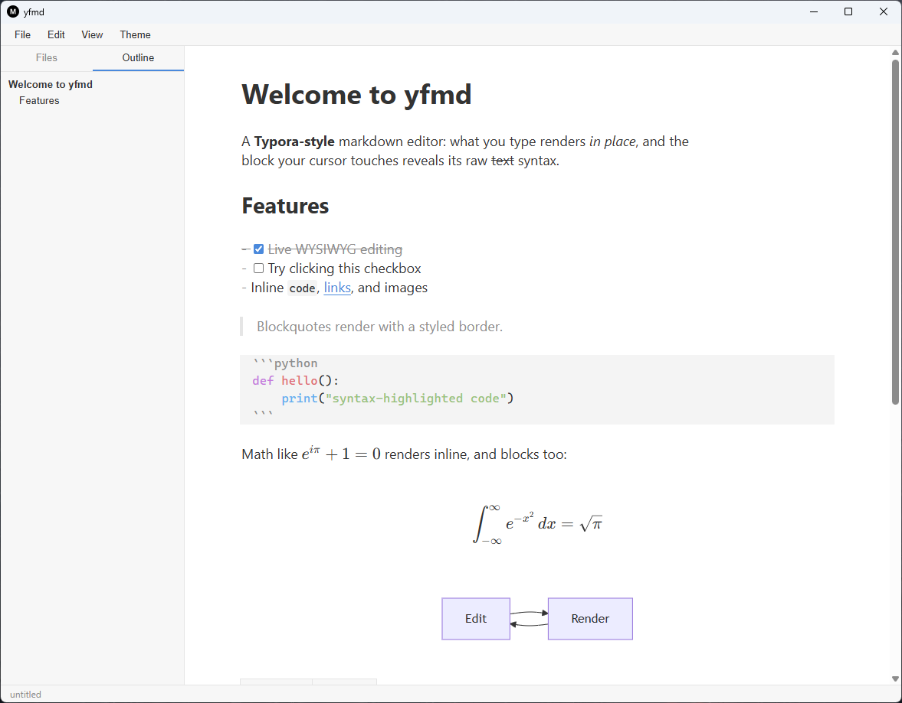

# yfmarkdown

A Typora-style markdown editor for the desktop, built with Tauri 2 and CodeMirror 6.
What you type renders in place — headings, bold, math, diagrams, tables — and the
block your cursor touches reveals its raw markdown syntax for editing.



## Features

- **Live WYSIWYG editing** — inline syntax (bold, italic, code, links, strikethrough)
  hides its markers until the cursor enters; headings, blockquotes, and code blocks
  are styled in place
- **Math** — inline `$…$` and block `$$…$$` rendered with KaTeX (currency-safe:
  `costs $5 and $10` stays text)
- **Mermaid diagrams** — fenced ` ```mermaid ` blocks render as SVG, with inline
  error boxes for invalid diagrams
- **Tables** — render as real HTML tables; clicking one drops you into
  pipe-aligned source, re-aligned automatically when the cursor enters
- **Task lists** — clickable checkboxes that update the source text
- **Sidebar** — folder file tree and a live document outline with jump-to-heading
- **Export** — standalone offline HTML (MathML math, inline mermaid SVG, inlined
  CSS/highlighting) and PDF via the system print dialog
- **Light/dark themes**, source-mode toggle (`Ctrl+/`), find/replace (`Ctrl+F`)

The markdown text is always the single source of truth: rendering is a decoration
layer on top of the document, and the file on disk is never auto-normalized —
with one deliberate exception, table pipe-alignment when the cursor enters a table.

## Development

```bash
npm install
npm run dev          # browser mode (in-memory file system) at http://localhost:5173
npm run tauri dev    # desktop app (requires Rust toolchain, see below)
npm test             # unit tests (Vitest)
npm run e2e          # end-to-end tests (Playwright, browser mode)
npm run typecheck    # TypeScript strict check
npm run build        # typecheck + production bundle
```

### Desktop prerequisites (Linux / WSL2)

The Tauri shell needs a Rust toolchain ≥ 1.77.2 and the WebKitGTK stack:

```bash
curl --proto '=https' --tlsv1.2 -sSf https://sh.rustup.rs | sh
sudo apt install libwebkit2gtk-4.1-dev libgtk-3-dev libayatana-appindicator3-dev \
  librsvg2-dev build-essential libssl-dev
```

## Architecture

- **Editor**: CodeMirror 6 with `@codemirror/lang-markdown` (GFM). A ViewPlugin
  hides syntax marks away from the cursor; a StateField renders block widgets
  (images, rules, math, mermaid, tables). Decorations never modify the text.
- **Shell**: React drives the menubar, sidebar, status bar, and dialogs, and talks
  to files only through a `FileService` interface — an in-memory implementation for
  browser dev/tests, a native one (dialogs, fs, folder listing via a Rust command)
  inside Tauri.
- **Export**: a separate markdown-it pipeline with KaTeX (`output: 'mathml'`) and
  mermaid-to-SVG post-processing produces fully offline HTML.

## License

MIT
