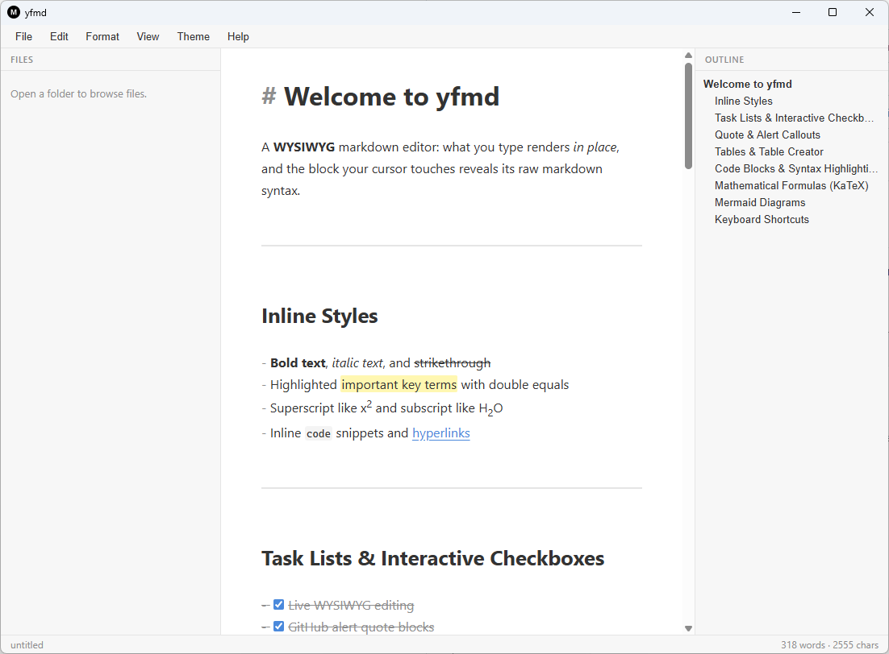

# yfmd

A WYSIWYG markdown editor for the desktop, built with Tauri 2 and CodeMirror 6.
What you type renders in place — headings, bold, math, diagrams, tables — and the
block your cursor touches reveals its raw markdown syntax for editing.



## Features

- **Live WYSIWYG editing** — inline syntax (bold, italic, code, links, strikethrough)
  hides its markers until the cursor enters; headings, blockquotes, and code blocks
  are styled in place
- **GitHub Alert Callouts** — supports `> [!NOTE]`, `> [!TIP]`, `> [!IMPORTANT]`,
  `> [!WARNING]`, and `> [!CAUTION]` with distinct colors and SVG title badges
- **Interactive Tables & Table Creator** — render as real HTML tables; visual
  $m \times n$ Table Creator dialog (`Format → Table → Table Creator…`), table actions
  (Add/Delete Row & Column), and auto-aligned pipe formatting
- **Math** — inline `$…$` and block `$$…$$` rendered with KaTeX (currency-safe:
  `costs $5 and $10` stays text)
- **Mermaid diagrams** — fenced ` ```mermaid ` blocks render as SVG, with inline
  error boxes for invalid diagrams
- **Task lists** — clickable checkboxes that update the source text
- **Markdown extensions** — `==highlight==`, `^superscript^`, `~subscript~`, and
  `:emoji:` shortcodes
- **References** — `[^id]` markers render as numbered superscripts and `[^id]: text`
  definitions as a numbered reference list, numbered by order of first reference;
  HTML export collects them into a footnotes section with back-links
- **Syntax support toggles** — a Settings tab switches References, Highlight, and
  Superscript/subscript on or off independently (all on by default), in both the
  editor and the exports
- **Images** — paste, drag-and-drop, or insert from the Format menu
- **Inline `#tags`** — styled and clickable in the rendered view
- **Table of contents** — inserted from the Format menu; heading anchors carry
  through to HTML export
- **Frontmatter** — a leading `---` YAML block renders as one quiet metadata box
  instead of a rule, a list and a stray heading; excluded from exports
- **Recent Files Management** — sub-menu in File menu with smart path disambiguation
  and per-file removal buttons
- **Settings & Typography** — customize editor/code fonts with CJK fallbacks, max
  text width, side margins, font size, line height, autosave, code block line numbers,
  and which optional markdown syntaxes are rendered
- **File panel** — folder file tree on the left; toggle with `F9`, drag its
  right edge to resize (width is remembered)
- **Outline panel** — a live document outline with jump-to-heading in its own
  panel on the right; toggle with `F10` (View menu), also resizable
- **Fullscreen Mode** — `F11` (View menu) toggles real fullscreen — the native
  window under Tauri, the Fullscreen API in the browser
- **Writing aids** — focus mode (`F8`, dims everything but the active line) and
  typewriter mode (View menu, keeps the cursor vertically centered),
  word/character count with reading time in the status bar
- **Custom themes** — import a Typora-style CSS theme (Theme menu), applied to
  both the editor and HTML export
- **Export** — standalone HTML (MathML math, inline mermaid SVG, alerts,
  inlined CSS/highlighting, embedded local images) and PDF via the system print dialog
- **Read-Only Mode** — View menu; locks the document (no typing, menu edit
  commands are inert), shows a `READ-ONLY` badge in the status bar
- **Help menu** — a Keyboard Shortcuts reference dialog, "Markdown Guide" (opens
  the built-in welcome document), Report an Issue, and Check for Updates
- **Light/dark themes**, source-mode toggle (`Ctrl+/`), find/replace (`Ctrl+F`)

The markdown text is always the single source of truth: rendering is a decoration
layer on top of the document, and the file on disk is never auto-normalized —
with one deliberate exception, table pipe-alignment when the cursor enters a table.

## Development

```bash
npm install
npm run dev          # browser mode (in-memory file system) at http://localhost:5173
npm run tauri dev    # desktop app (requires Rust toolchain, see below)
npm test             # unit tests (Vitest)
npm run test:coverage # unit tests + coverage report and thresholds
npm run e2e          # end-to-end tests (Playwright, browser mode)
npm run typecheck    # TypeScript strict check
npm run build        # typecheck + production bundle
```

### Desktop prerequisites (Linux / WSL2)

The Tauri shell needs a Rust toolchain ≥ 1.77.2 and the WebKitGTK stack:

```bash
curl --proto '=https' --tlsv1.2 -sSf https://sh.rustup.rs | sh
sudo apt install libwebkit2gtk-4.1-dev libgtk-3-dev libayatana-appindicator3-dev \
  librsvg2-dev build-essential libssl-dev
```

## Architecture

- **Editor**: CodeMirror 6 with `@codemirror/lang-markdown` (GFM). A ViewPlugin
  hides syntax marks away from the cursor; a StateField renders block widgets
  (images, rules, math, mermaid, tables). Decorations never modify the text.
- **Shell**: React drives the menubar, sidebar, status bar, and dialogs, and talks
  to files only through a `FileService` interface — an in-memory implementation for
  browser dev/tests, a native one (dialogs, fs, folder listing via a Rust command)
  inside Tauri.
- **Export**: a separate markdown-it pipeline with KaTeX (`output: 'mathml'`) and
  mermaid-to-SVG post-processing produces standalone HTML with embedded local images.
  Remote images retain their URLs and require a network connection.

## CI & releases

GitHub Actions builds the desktop app on Linux, macOS and Windows on every push
to `main` and every PR. Pushing a `v*` tag (with `src-tauri/tauri.conf.json`'s
`version` bumped to match) publishes a draft GitHub release with installers for
all three platforms via the `release` workflow.

## License

[MIT](LICENSE) © 2026 automaticdai

