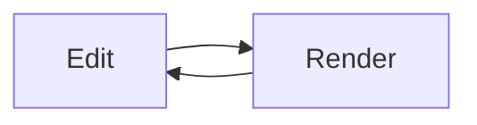

# yfmarkdown Implementation Plan

> **For agentic workers:** REQUIRED SUB-SKILL: Use superpowers:subagent-driven-development (recommended) or superpowers:executing-plans to implement this plan task-by-task. Steps use checkbox (`- [ ]`) syntax for tracking.

**Goal:** Build a Tauri 2 desktop markdown editor with Typora-style in-place WYSIWYG editing (syntax reveals at the cursor), sidebar file tree + outline, HTML/PDF export, and light/dark themes.

**Architecture:** CodeMirror 6 is the editor; the raw markdown text is the single source of truth. A "live preview" layer (a ViewPlugin for syntax-mark hiding + a StateField for rendered widgets) decorates the document; decorations never modify the text. The React shell (menubar, sidebar, status bar) talks to files only through a `FileService` interface with a browser implementation (dev/tests) and a Tauri implementation (production). Export uses a separate markdown-it pipeline.

**Tech Stack:** Tauri 2 (Rust), React 19, TypeScript (strict), Vite 7, CodeMirror 6 (@codemirror/lang-markdown + Lezer), KaTeX, Mermaid 11, markdown-it 14, highlight.js 11, Vitest 3, Playwright.

## Global Constraints

- Spec: `docs/superpowers/specs/2026-07-17-yfmarkdown-design.md`. The markdown text is never auto-normalized, with ONE exception: table pipe-alignment when the cursor enters a table.
- Product name `yfmarkdown`, Tauri identifier `com.automaticdai.yfmd`, window title `yfmarkdown`.
- TypeScript strict mode everywhere; Rust only in `src-tauri/`.
- Exported HTML must work offline: math is rendered as MathML (`katex` with `output: 'mathml'`), mermaid as inline SVG, CSS inlined. No CDN references.
- Unit tests: Vitest, node environment, colocated `src/**/*.test.ts`. E2E: Playwright in `e2e/`, running against the Vite dev server on port 5183 (browser FileService).
- Vitest tests must not need a DOM (jsdom is not a dependency): only test pure functions and `EditorState`-level logic (EditorState works headless; `WidgetType.toDOM` is never called in unit tests).
- Node ≥ 20 (machine has v22.22.2, npm 10.9.7). Rust toolchain on the machine is 1.75 — too old for Tauri 2; Task 14 runs `rustup update stable` before any cargo build.
- Commit after every task with a conventional-commit message. Never commit `node_modules/`, `dist/`, `src-tauri/target/`.
- One editor instance, one document open at a time. No tabs.

## File Structure

```
package.json  vite.config.ts  tsconfig.json  index.html  playwright.config.ts  .gitignore
src/
  main.tsx  App.tsx  vite-env.d.ts
  assets/welcome.md                 # sample doc showcasing all features
  styles/base.css                   # CSS variables, light/dark themes, app chrome
  styles/editor.css                 # editor typography + widget styles
  services/file-service.ts          # FileService interface, FileEntry, path helpers, createFileService()
  services/browser-file-service.ts  # in-memory impl for dev + e2e
  services/tauri-file-service.ts    # Tauri impl (Task 14)
  editor/setup.ts                   # createExtensions(): full CM6 extension list
  editor/highlight.ts               # HighlightStyle (markdown tags → CSS classes)
  editor/commands.ts                # toggleBold/Italic/Code/Strike, insertLink
  editor/live-preview/facets.ts     # imageResolver + uiTheme facets, rebuildWidgets effect
  editor/live-preview/cursor-context.ts     # selectionTouches, selectionTouchesLine
  editor/live-preview/inline-decorations.ts # mark hiding + line classes (ViewPlugin)
  editor/live-preview/task-list.ts          # checkbox widgets + toggleTaskAt
  editor/live-preview/link-click.ts         # Ctrl+Click opens links
  editor/live-preview/widget-field.ts       # StateField: image/hr/math/mermaid/table widgets
  editor/live-preview/math.ts               # findMathRanges + MathWidget (KaTeX)
  editor/live-preview/mermaid-widget.ts     # MermaidWidget (async render, error box)
  editor/live-preview/table.ts              # parseTable/formatTable/TableWidget/tableAutoFormat
  editor/live-preview/index.ts              # livePreviewExtensions() bundle + compartment
  app/document-controller.ts        # open/save/dirty/guard logic (no React)
  app/MenuBar.tsx  app/StatusBar.tsx  app/ConfirmDialog.tsx
  sidebar/Sidebar.tsx  sidebar/FileTreePane.tsx  sidebar/OutlinePane.tsx
  outline/outline.ts                # extractOutline(state)
  export/render-html.ts             # markdown-it pipeline → standalone HTML
  export/export.ts                  # exportHtml / exportPdf
src-tauri/                          # Task 14: Rust shell, config, capabilities
e2e/editing.spec.ts  e2e/widgets.spec.ts  e2e/app.spec.ts
```

Lezer markdown node names used throughout (from `@codemirror/lang-markdown`'s `markdownLanguage`, which includes GFM): `ATXHeading1..6`, `SetextHeading1/2`, `HeaderMark`, `Blockquote`, `QuoteMark`, `Emphasis`, `StrongEmphasis`, `EmphasisMark`, `InlineCode`, `CodeMark`, `CodeInfo`, `CodeText`, `FencedCode`, `Strikethrough`, `StrikethroughMark`, `Link`, `LinkMark`, `URL`, `Image`, `HorizontalRule`, `Table`, `Task`, `TaskMarker`.

---

### Task 1: Project scaffold

**Files:**
- Create: `package.json`, `vite.config.ts`, `tsconfig.json`, `index.html`, `.gitignore`, `src/main.tsx`, `src/App.tsx`, `src/vite-env.d.ts`, `src/styles/base.css`, `src/assets/welcome.md`, `src/sanity.test.ts`

**Interfaces:**
- Consumes: nothing.
- Produces: a running Vite+React app (`npm run dev`), passing `npm test` and `npm run typecheck`. CSS variables consumed by every later task: `--bg`, `--fg`, `--fg-muted`, `--accent`, `--border`, `--sidebar-bg`, `--code-bg`, `--error`, set per `[data-theme="light"|"dark"]`.

- [ ] **Step 1: Write config + entry files**

`.gitignore`:

```
node_modules/
dist/
src-tauri/target/
test-results/
playwright-report/
```

`package.json` (npm will fill exact versions on install):

```json
{
  "name": "yfmarkdown",
  "private": true,
  "version": "0.1.0",
  "type": "module",
  "scripts": {
    "dev": "vite",
    "build": "tsc --noEmit && vite build",
    "preview": "vite preview",
    "typecheck": "tsc --noEmit",
    "test": "vitest run",
    "test:watch": "vitest",
    "e2e": "playwright test",
    "tauri": "tauri"
  },
  "dependencies": {
    "@codemirror/commands": "^6.8.1",
    "@codemirror/lang-markdown": "^6.3.2",
    "@codemirror/language": "^6.11.0",
    "@codemirror/language-data": "^6.5.1",
    "@codemirror/search": "^6.5.11",
    "@codemirror/state": "^6.5.2",
    "@codemirror/view": "^6.38.0",
    "@lezer/common": "^1.2.3",
    "@lezer/highlight": "^1.2.1",
    "@tauri-apps/api": "^2.5.0",
    "@tauri-apps/plugin-dialog": "^2.2.2",
    "@tauri-apps/plugin-fs": "^2.3.0",
    "@tauri-apps/plugin-opener": "^2.2.7",
    "highlight.js": "^11.11.1",
    "katex": "^0.16.22",
    "markdown-it": "^14.1.0",
    "mermaid": "^11.6.0",
    "react": "^19.1.0",
    "react-dom": "^19.1.0"
  },
  "devDependencies": {
    "@playwright/test": "^1.53.0",
    "@tauri-apps/cli": "^2.5.0",
    "@types/katex": "^0.16.7",
    "@types/markdown-it": "^14.1.2",
    "@types/react": "^19.1.0",
    "@types/react-dom": "^19.1.0",
    "@vitejs/plugin-react": "^4.6.0",
    "typescript": "~5.8.3",
    "vite": "^7.0.0",
    "vitest": "^3.2.0"
  }
}
```

`vite.config.ts`:

```ts
/// <reference types="vitest/config" />
import { defineConfig } from 'vite'
import react from '@vitejs/plugin-react'

export default defineConfig({
  plugins: [react()],
  clearScreen: false,
  server: { port: 5173, strictPort: true },
  test: {
    environment: 'node',
    include: ['src/**/*.test.ts'],
  },
})
```

`tsconfig.json`:

```json
{
  "compilerOptions": {
    "target": "ES2022",
    "lib": ["ES2022", "DOM", "DOM.Iterable"],
    "module": "ESNext",
    "moduleResolution": "bundler",
    "jsx": "react-jsx",
    "strict": true,
    "noUnusedLocals": true,
    "noUnusedParameters": true,
    "noFallthroughCasesInSwitch": true,
    "skipLibCheck": true,
    "isolatedModules": true,
    "noEmit": true,
    "useDefineForClassFields": true
  },
  "include": ["src", "e2e", "vite.config.ts", "playwright.config.ts"]
}
```

`index.html`:

```html
<!doctype html>
<html lang="en">
  <head>
    <meta charset="UTF-8" />
    <meta name="viewport" content="width=device-width, initial-scale=1.0" />
    <title>yfmarkdown</title>
  </head>
  <body>
    <div id="root"></div>
    <script type="module" src="/src/main.tsx"></script>
  </body>
</html>
```

`src/vite-env.d.ts`:

```ts
/// <reference types="vite/client" />
```

`src/main.tsx`:

```tsx
import React from 'react'
import ReactDOM from 'react-dom/client'
import App from './App'
import './styles/base.css'

ReactDOM.createRoot(document.getElementById('root')!).render(
  <React.StrictMode>
    <App />
  </React.StrictMode>,
)
```

`src/App.tsx` (placeholder; replaced in Task 3):

```tsx
export default function App() {
  return <div className="app">yfmarkdown</div>
}
```

`src/styles/base.css`:

```css
:root, [data-theme='light'] {
  --bg: #ffffff;
  --fg: #333333;
  --fg-muted: #8e8e8e;
  --accent: #4a89dc;
  --border: #e5e5e5;
  --sidebar-bg: #f7f7f7;
  --code-bg: #f4f4f4;
  --error: #c0392b;
}
[data-theme='dark'] {
  --bg: #1e1e1e;
  --fg: #d4d4d4;
  --fg-muted: #7f7f7f;
  --accent: #6ea8fe;
  --border: #3a3a3a;
  --sidebar-bg: #252526;
  --code-bg: #2a2a2a;
  --error: #e07b6a;
}
* { box-sizing: border-box; }
html, body, #root { height: 100%; margin: 0; }
body {
  font-family: -apple-system, BlinkMacSystemFont, 'Segoe UI', Roboto, 'Helvetica Neue', Arial, sans-serif;
  background: var(--bg);
  color: var(--fg);
}
.app { display: flex; flex-direction: column; height: 100%; }
.app-body { display: flex; flex: 1; min-height: 0; }
.editor-pane { flex: 1; min-width: 0; overflow: hidden; }
```

`src/assets/welcome.md`:

````markdown
# Welcome to yfmarkdown

A **Typora-style** markdown editor: what you type renders *in place*, and the
block your cursor touches reveals its raw ~~text~~ syntax.

## Features

- [x] Live WYSIWYG editing
- [ ] Try clicking this checkbox
- Inline `code`, [links](https://github.com/automaticdai/yfmd), and images

> Blockquotes render with a styled border.

```python
def hello():
    print("syntax-highlighted code")
```

Math like $e^{i\pi} + 1 = 0$ renders inline, and blocks too:

$$
\int_{-\infty}^{\infty} e^{-x^2}\,dx = \sqrt{\pi}
$$



| Feature | Status |
| ------- | :----: |
| Tables  |   ✔    |
| Export  |   ✔    |

---

Press `Ctrl+/` for source mode.
````

`src/sanity.test.ts`:

```ts
import { describe, expect, it } from 'vitest'

describe('sanity', () => {
  it('runs', () => {
    expect(1 + 1).toBe(2)
  })
})
```

- [ ] **Step 2: Install and verify**

Run: `npm install`
Expected: completes without errors (peer warnings acceptable).

Run: `npm test`
Expected: 1 passed.

Run: `npm run typecheck`
Expected: exit 0.

Run: `npm run dev &` then `curl -s http://localhost:5173 | grep yfmarkdown` then kill the dev server.
Expected: title found in HTML.

- [ ] **Step 3: Commit**

```bash
git add -A
git commit -m "feat: scaffold Vite + React + TypeScript project with themes and sample doc"
```

---

### Task 2: FileService interface + browser implementation

**Files:**
- Create: `src/services/file-service.ts`, `src/services/browser-file-service.ts`, `src/services/file-service.test.ts`

**Interfaces:**
- Consumes: `src/assets/welcome.md` (via `?raw` import).
- Produces (used by ALL later tasks):

```ts
export interface FileEntry { name: string; path: string; isDir: boolean; children?: FileEntry[] }
export interface OpenedFile { path: string; content: string }
export interface OpenedFolder { path: string; tree: FileEntry[] }
export interface FileService {
  openFileDialog(): Promise<OpenedFile | null>
  openFolderDialog(): Promise<OpenedFolder | null>
  readFile(path: string): Promise<string>
  writeFile(path: string, content: string): Promise<void>
  saveFileDialog(defaultName: string): Promise<string | null>   // chosen absolute path or null
  resolveResource(docPath: string | null, src: string): string  // image src → displayable URL
  openExternal(url: string): Promise<void>
}
export function isMarkdownFile(name: string): boolean
export function normalizePath(p: string): string                 // resolves ./ and ../ segments
export function dirname(p: string): string
export async function createFileService(): Promise<FileService>  // picks Tauri or browser impl
export function buildTree(paths: string[]): FileEntry[]          // nested tree from sorted paths
```

- `BrowserFileService` extras used by e2e tests: `files: Map<string, string>` (seeded docs), `dialogQueue: (string | null)[]` (pre-programmed dialog answers; `openFileDialog`/`openFolderDialog`/`saveFileDialog` shift from it), instance exposed as `window.__yfmdFs`.

- [ ] **Step 1: Write the failing tests**

`src/services/file-service.test.ts`:

```ts
import { describe, expect, it } from 'vitest'
import { buildTree, dirname, isMarkdownFile, normalizePath } from './file-service'
import { BrowserFileService } from './browser-file-service'

describe('path helpers', () => {
  it('detects markdown files', () => {
    expect(isMarkdownFile('a.md')).toBe(true)
    expect(isMarkdownFile('B.MARKDOWN')).toBe(true)
    expect(isMarkdownFile('c.txt')).toBe(true)
    expect(isMarkdownFile('d.png')).toBe(false)
  })
  it('normalizes paths', () => {
    expect(normalizePath('/a/b/../c/./d.md')).toBe('/a/c/d.md')
    expect(normalizePath('/a//b.md')).toBe('/a/b.md')
  })
  it('dirname', () => {
    expect(dirname('/a/b/c.md')).toBe('/a/b')
    expect(dirname('c.md')).toBe('')
  })
})

describe('buildTree', () => {
  it('nests folders and sorts dirs first', () => {
    const tree = buildTree(['/docs/z.md', '/docs/sub/a.md', '/readme.md'])
    expect(tree.map(e => e.name)).toEqual(['docs', 'readme.md'])
    const docs = tree[0]
    expect(docs.isDir).toBe(true)
    expect(docs.children!.map(e => e.name)).toEqual(['sub', 'z.md'])
    expect(docs.children![0].children![0].path).toBe('/docs/sub/a.md')
  })
})

describe('BrowserFileService', () => {
  it('reads and writes in-memory files', async () => {
    const fs = new BrowserFileService()
    await fs.writeFile('/notes/a.md', '# A')
    expect(await fs.readFile('/notes/a.md')).toBe('# A')
    await expect(fs.readFile('/missing.md')).rejects.toThrow(/not found/i)
  })
  it('answers dialogs from the queue', async () => {
    const fs = new BrowserFileService()
    await fs.writeFile('/notes/a.md', '# A')
    fs.dialogQueue.push('/notes/a.md', null)
    expect(await fs.openFileDialog()).toEqual({ path: '/notes/a.md', content: '# A' })
    expect(await fs.openFileDialog()).toBeNull()
  })
  it('opens folders as trees scoped to the folder', async () => {
    const fs = new BrowserFileService()
    await fs.writeFile('/notes/a.md', 'a')
    await fs.writeFile('/notes/sub/b.md', 'b')
    await fs.writeFile('/other/c.md', 'c')
    fs.dialogQueue.push('/notes')
    const folder = await fs.openFolderDialog()
    expect(folder!.path).toBe('/notes')
    expect(folder!.tree.map(e => e.name)).toEqual(['sub', 'a.md'])
  })
})
```

- [ ] **Step 2: Run tests to verify they fail**

Run: `npm test`
Expected: FAIL — cannot resolve `./file-service`.

- [ ] **Step 3: Implement**

`src/services/file-service.ts`:

```ts
export interface FileEntry {
  name: string
  path: string
  isDir: boolean
  children?: FileEntry[]
}

export interface OpenedFile { path: string; content: string }
export interface OpenedFolder { path: string; tree: FileEntry[] }

export interface FileService {
  openFileDialog(): Promise<OpenedFile | null>
  openFolderDialog(): Promise<OpenedFolder | null>
  readFile(path: string): Promise<string>
  writeFile(path: string, content: string): Promise<void>
  saveFileDialog(defaultName: string): Promise<string | null>
  resolveResource(docPath: string | null, src: string): string
  openExternal(url: string): Promise<void>
}

const MD_EXTENSIONS = ['md', 'markdown', 'mdown', 'txt']

export function isMarkdownFile(name: string): boolean {
  const ext = name.slice(name.lastIndexOf('.') + 1).toLowerCase()
  return name.includes('.') && MD_EXTENSIONS.includes(ext)
}

export function normalizePath(p: string): string {
  const abs = p.startsWith('/')
  const out: string[] = []
  for (const seg of p.split('/')) {
    if (seg === '' || seg === '.') continue
    if (seg === '..') out.pop()
    else out.push(seg)
  }
  return (abs ? '/' : '') + out.join('/')
}

export function dirname(p: string): string {
  const i = p.lastIndexOf('/')
  return i <= 0 ? (i === 0 ? '/' : '') : p.slice(0, i)
}

/** Build a nested FileEntry tree from absolute paths; dirs first, then alpha. */
export function buildTree(paths: string[]): FileEntry[] {
  const root: FileEntry[] = []
  for (const path of [...paths].sort()) {
    const segs = path.replace(/^\//, '').split('/')
    let level = root
    let cur = ''
    for (let i = 0; i < segs.length; i++) {
      cur += '/' + segs[i]
      const isLeaf = i === segs.length - 1
      let entry = level.find(e => e.name === segs[i])
      if (!entry) {
        entry = { name: segs[i], path: cur, isDir: !isLeaf, ...(isLeaf ? {} : { children: [] }) }
        level.push(entry)
      }
      if (!isLeaf) level = entry.children!
    }
  }
  const sortLevel = (entries: FileEntry[]) => {
    entries.sort((a, b) =>
      a.isDir !== b.isDir ? (a.isDir ? -1 : 1) : a.name.localeCompare(b.name))
    for (const e of entries) if (e.children) sortLevel(e.children)
  }
  sortLevel(root)
  return root
}

export async function createFileService(): Promise<FileService> {
  if (typeof window !== 'undefined' && '__TAURI_INTERNALS__' in window) {
    const { TauriFileService } = await import('./tauri-file-service')
    return new TauriFileService()
  }
  const { BrowserFileService } = await import('./browser-file-service')
  return new BrowserFileService()
}
```

`src/services/browser-file-service.ts`:

```ts
import welcome from '../assets/welcome.md?raw'
import {
  buildTree, type FileEntry, type FileService, type OpenedFile, type OpenedFolder,
} from './file-service'

/**
 * In-memory FileService for browser dev and e2e tests.
 * Dialogs are answered from `dialogQueue` (paths pushed by tests); an empty
 * queue falls back to the first markdown file / a generated untitled path.
 */
export class BrowserFileService implements FileService {
  files = new Map<string, string>([['/welcome.md', welcome]])
  dialogQueue: (string | null)[] = []
  private untitledCounter = 0

  constructor() {
    if (typeof window !== 'undefined') {
      ;(window as unknown as Record<string, unknown>).__yfmdFs = this
    }
  }

  private nextAnswer(fallback: string | null): string | null {
    return this.dialogQueue.length > 0 ? this.dialogQueue.shift()! : fallback
  }

  async openFileDialog(): Promise<OpenedFile | null> {
    const path = this.nextAnswer([...this.files.keys()][0] ?? null)
    if (path === null) return null
    return { path, content: await this.readFile(path) }
  }

  async openFolderDialog(): Promise<OpenedFolder | null> {
    const path = this.nextAnswer('/')
    if (path === null) return null
    const prefix = path === '/' ? '/' : path + '/'
    const inside = [...this.files.keys()].filter(p => p.startsWith(prefix))
    const rel = inside.map(p => '/' + p.slice(prefix.length))
    const tree = buildTree(rel)
    const fix = (entries: FileEntry[]): FileEntry[] =>
      entries.map(e => ({
        ...e,
        path: (path === '/' ? '' : path) + e.path,
        children: e.children ? fix(e.children) : undefined,
      }))
    return { path, tree: fix(tree) }
  }

  async readFile(path: string): Promise<string> {
    const content = this.files.get(path)
    if (content === undefined) throw new Error(`File not found: ${path}`)
    return content
  }

  async writeFile(path: string, content: string): Promise<void> {
    this.files.set(path, content)
  }

  async saveFileDialog(defaultName: string): Promise<string | null> {
    return this.nextAnswer(`/untitled-${++this.untitledCounter}-${defaultName}`)
  }

  resolveResource(_docPath: string | null, src: string): string {
    return src
  }

  async openExternal(url: string): Promise<void> {
    window.open(url, '_blank', 'noopener')
  }
}
```

- [ ] **Step 4: Run tests to verify they pass**

Run: `npm test` and `npm run typecheck`
Expected: all pass, exit 0.

- [ ] **Step 5: Commit**

```bash
git add src/services
git commit -m "feat: add FileService interface with in-memory browser implementation"
```

---

### Task 3: CodeMirror editor mounts with markdown highlighting and typography

**Files:**
- Create: `src/editor/highlight.ts`, `src/editor/setup.ts`, `src/styles/editor.css`, `src/editor/setup.test.ts`
- Modify: `src/App.tsx`, `src/main.tsx` (import editor.css)

**Interfaces:**
- Consumes: CSS variables from Task 1.
- Produces:
  - `createExtensions(opts: EditorOptions): Extension[]` from `src/editor/setup.ts` where `interface EditorOptions { onDocChanged(): void; onToggleSource(): void; openExternal(url: string): void }`.
  - `mdHighlightStyle: HighlightStyle` from `src/editor/highlight.ts`.
  - Compartments exported from `setup.ts`: `livePreviewCompartment`, `resolverCompartment`, `themeCompartment` (all `new Compartment()`; live-preview content arrives in later tasks via `src/editor/live-preview/index.ts`).
  - App shape: `App.tsx` mounts an `EditorView` into `<main className="editor-pane">` holding the welcome doc; `window.__yfmdView = view` is set in dev builds for e2e assertions.

- [ ] **Step 1: Write the failing test**

`src/editor/setup.test.ts`:

```ts
import { EditorState } from '@codemirror/state'
import { describe, expect, it } from 'vitest'
import { syntaxTree } from '@codemirror/language'
import { createExtensions } from './setup'

const noop = { onDocChanged() {}, onToggleSource() {}, openExternal() {} }

describe('createExtensions', () => {
  it('creates a state that parses markdown', () => {
    const state = EditorState.create({ doc: '# Hi\n**bold**', extensions: createExtensions(noop) })
    const names: string[] = []
    syntaxTree(state).iterate({ enter: n => void names.push(n.name) })
    expect(names).toContain('ATXHeading1')
    expect(names).toContain('StrongEmphasis')
  })
  it('parses GFM tables and strikethrough', () => {
    const state = EditorState.create({ doc: '| a |\n| - |\n| b |\n\n~~x~~', extensions: createExtensions(noop) })
    const names: string[] = []
    syntaxTree(state).iterate({ enter: n => void names.push(n.name) })
    expect(names).toContain('Table')
    expect(names).toContain('Strikethrough')
  })
})
```

- [ ] **Step 2: Run test to verify it fails**

Run: `npm test`
Expected: FAIL — cannot resolve `./setup`.

- [ ] **Step 3: Implement**

`src/editor/highlight.ts`:

```ts
import { HighlightStyle } from '@codemirror/language'
import { tags } from '@lezer/highlight'

/** Maps markdown tokens to CSS classes styled in styles/editor.css. */
export const mdHighlightStyle = HighlightStyle.define([
  { tag: tags.strong, class: 'tok-strong' },
  { tag: tags.emphasis, class: 'tok-em' },
  { tag: tags.strikethrough, class: 'tok-strike' },
  { tag: tags.monospace, class: 'tok-mono' },
  { tag: tags.link, class: 'tok-link' },
  { tag: tags.url, class: 'tok-url' },
  { tag: tags.heading, class: 'tok-heading' },
  { tag: tags.quote, class: 'tok-quote' },
  { tag: tags.comment, class: 'tok-comment' },
  { tag: tags.keyword, class: 'tok-kw' },
  { tag: tags.string, class: 'tok-str' },
  { tag: tags.number, class: 'tok-num' },
  { tag: tags.typeName, class: 'tok-type' },
  { tag: tags.function(tags.variableName), class: 'tok-fn' },
  { tag: tags.definition(tags.variableName), class: 'tok-def' },
  { tag: tags.propertyName, class: 'tok-prop' },
  { tag: tags.operator, class: 'tok-op' },
  { tag: tags.meta, class: 'tok-meta' },
])
```

`src/editor/setup.ts`:

```ts
import { defaultKeymap, history, historyKeymap } from '@codemirror/commands'
import { markdown, markdownLanguage } from '@codemirror/lang-markdown'
import { syntaxHighlighting } from '@codemirror/language'
import { languages } from '@codemirror/language-data'
import { search, searchKeymap } from '@codemirror/search'
import { Compartment, type Extension, Prec } from '@codemirror/state'
import { EditorView, drawSelection, keymap } from '@codemirror/view'
import { mdHighlightStyle } from './highlight'

export interface EditorOptions {
  onDocChanged(): void
  onToggleSource(): void
  openExternal(url: string): void
}

export const livePreviewCompartment = new Compartment()
export const resolverCompartment = new Compartment()
export const themeCompartment = new Compartment()

export function createExtensions(opts: EditorOptions): Extension[] {
  return [
    history(),
    drawSelection(),
    EditorView.lineWrapping,
    markdown({ base: markdownLanguage, codeLanguages: languages }),
    syntaxHighlighting(mdHighlightStyle),
    search({ top: true }),
    Prec.high(keymap.of([
      { key: 'Mod-/', run: () => (opts.onToggleSource(), true) },
    ])),
    keymap.of([...defaultKeymap, ...historyKeymap, ...searchKeymap]),
    livePreviewCompartment.of([]),
    resolverCompartment.of([]),
    themeCompartment.of([]),
    EditorView.updateListener.of(u => {
      if (u.docChanged) opts.onDocChanged()
    }),
    EditorView.theme({
      '&': { height: '100%', fontSize: '16px' },
      '.cm-scroller': { overflow: 'auto' },
      '&.cm-focused': { outline: 'none' },
    }),
  ]
}
```

`src/styles/editor.css` (Typora-ish typography; widget styles used by later tasks included now so they land once):

```css
.cm-editor { height: 100%; background: var(--bg); color: var(--fg); }
.cm-scroller {
  font-family: 'Segoe UI', -apple-system, BlinkMacSystemFont, 'Helvetica Neue', sans-serif;
  line-height: 1.7;
  padding: 2rem 0 40vh 0;
}
.cm-content {
  max-width: 46rem;
  margin: 0 auto;
  padding: 0 3rem;
  caret-color: var(--fg);
}
.cm-line { padding: 0 2px; }
.cm-cursor { border-left-color: var(--fg); }

/* inline tokens */
.tok-strong { font-weight: 700; }
.tok-em { font-style: italic; }
.tok-strike { text-decoration: line-through; }
.tok-mono, .cm-inline-code {
  font-family: 'Cascadia Code', 'Fira Code', Consolas, monospace;
  font-size: 0.9em;
}
.cm-inline-code { background: var(--code-bg); border-radius: 3px; padding: 1px 2px; }
.tok-link, .tok-url { color: var(--accent); }
.cm-link-text { color: var(--accent); text-decoration: underline; text-underline-offset: 3px; cursor: pointer; }
.cm-syntax-dim { color: var(--fg-muted); }

/* headings */
.cm-heading-line { font-weight: 700; line-height: 1.4; }
.cm-heading-line-1 { font-size: 2em; padding-top: 0.6em; padding-bottom: 0.25em; }
.cm-heading-line-2 { font-size: 1.6em; padding-top: 0.5em; padding-bottom: 0.2em; }
.cm-heading-line-3 { font-size: 1.3em; padding-top: 0.4em; }
.cm-heading-line-4 { font-size: 1.15em; padding-top: 0.3em; }
.cm-heading-line-5 { font-size: 1em; }
.cm-heading-line-6 { font-size: 1em; color: var(--fg-muted); }

/* blockquote */
.cm-quote-line { border-left: 4px solid var(--border); padding-left: 1em !important; color: var(--fg-muted); }

/* code blocks */
.cm-codeblock-line {
  background: var(--code-bg);
  font-family: 'Cascadia Code', 'Fira Code', Consolas, monospace;
  font-size: 0.9em;
  padding-left: 1em !important;
  padding-right: 1em !important;
}
/* code token colors */
.tok-comment { color: #9aa0a6; font-style: italic; }
.tok-kw { color: #c678dd; }
.tok-str { color: #98c379; }
.tok-num { color: #d19a66; }
.tok-type { color: #e5c07b; }
.tok-fn { color: #61afef; }
.tok-def { color: #e06c75; }
.tok-prop { color: #56b6c2; }
.tok-op { color: var(--fg-muted); }
.tok-meta { color: var(--fg-muted); }

/* tables (source view while editing) */
.cm-table-line { font-family: 'Cascadia Code', 'Fira Code', Consolas, monospace; font-size: 0.9em; }
/* table widget */
.cm-table-widget { border-collapse: collapse; margin: 0.5em 0; cursor: pointer; }
.cm-table-widget th, .cm-table-widget td { border: 1px solid var(--border); padding: 0.35em 0.9em; }
.cm-table-widget th { background: var(--sidebar-bg); font-weight: 600; }

/* task lists */
.cm-task-checkbox { margin-right: 0.4em; accent-color: var(--accent); cursor: pointer; }
.cm-task-done { color: var(--fg-muted); text-decoration: line-through; }

/* widgets */
.cm-image-widget { max-width: 100%; cursor: pointer; vertical-align: bottom; }
.cm-image-broken {
  color: var(--error); background: var(--code-bg);
  padding: 2px 6px; border-radius: 3px; font-size: 0.85em; cursor: pointer;
}
.cm-math-inline { cursor: pointer; }
.cm-math-block { text-align: center; padding: 0.5em 0; cursor: pointer; }
.cm-mermaid { display: flex; justify-content: center; padding: 0.5em 0; cursor: pointer; }
.cm-widget-error {
  color: var(--error); background: var(--code-bg); border: 1px solid var(--error);
  border-radius: 4px; padding: 0.4em 0.8em; font-family: monospace; font-size: 0.85em;
  white-space: pre-wrap;
}
.cm-hr-widget { border: none; border-top: 2px solid var(--border); margin: 0.4em 0; cursor: pointer; }

/* search panel */
.cm-panels { background: var(--sidebar-bg); color: var(--fg); border-color: var(--border); }
.cm-panels input, .cm-panels button {
  background: var(--bg); color: var(--fg); border: 1px solid var(--border); border-radius: 3px;
}
```

Replace `src/App.tsx`:

```tsx
import { useEffect, useRef } from 'react'
import { EditorState } from '@codemirror/state'
import { EditorView } from '@codemirror/view'
import welcome from './assets/welcome.md?raw'
import { createExtensions } from './editor/setup'

export default function App() {
  const hostRef = useRef<HTMLDivElement>(null)
  const viewRef = useRef<EditorView | null>(null)

  useEffect(() => {
    if (!hostRef.current || viewRef.current) return
    const view = new EditorView({
      state: EditorState.create({
        doc: welcome,
        extensions: createExtensions({
          onDocChanged() {},
          onToggleSource() {},
          openExternal(url) { window.open(url, '_blank', 'noopener') },
        }),
      }),
      parent: hostRef.current,
    })
    viewRef.current = view
    if (import.meta.env.DEV) {
      ;(window as unknown as Record<string, unknown>).__yfmdView = view
    }
    return () => { view.destroy(); viewRef.current = null }
  }, [])

  return (
    <div className="app">
      <div className="app-body">
        <main className="editor-pane"><div ref={hostRef} style={{ height: '100%' }} /></main>
      </div>
    </div>
  )
}
```

In `src/main.tsx` add after the base.css import:

```ts
import './styles/editor.css'
```

- [ ] **Step 4: Run tests, typecheck, and eyeball the app**

Run: `npm test && npm run typecheck`
Expected: pass.

Run: `npm run dev &`, then with a browser tool or curl confirm the page loads; the welcome doc should show with heading/bold/code coloring (no hiding yet). Kill the server.

- [ ] **Step 5: Commit**

```bash
git add -A
git commit -m "feat: mount CodeMirror 6 markdown editor with highlighting and typography"
```

---

### Task 4: Cursor context + inline mark hiding (the Typora reveal behavior)

**Files:**
- Create: `src/editor/live-preview/cursor-context.ts`, `src/editor/live-preview/inline-decorations.ts`, `src/editor/live-preview/index.ts`, `src/editor/live-preview/inline-decorations.test.ts`
- Modify: `src/App.tsx` (activate live preview via compartment)

**Interfaces:**
- Consumes: `createExtensions`, `livePreviewCompartment` (Task 3).
- Produces:
  - `selectionTouches(state: EditorState, from: number, to: number): boolean` and `selectionTouchesLine(state: EditorState, pos: number): boolean` from `cursor-context.ts`.
  - `buildInlineDecorations(state: EditorState): { hides: DecorationSet; lines: DecorationSet }` and `inlineDecorations: ViewPlugin` (exported as the plugin extension) from `inline-decorations.ts`.
  - `livePreviewExtensions(): Extension[]` from `live-preview/index.ts` — later tasks append to this array; App activates it with `livePreviewCompartment.of(livePreviewExtensions())`.
  - Test helper pattern used by all later decoration tests:

```ts
function mkState(doc: string, cursor = 0): EditorState {
  return EditorState.create({
    doc,
    selection: EditorSelection.cursor(cursor),
    extensions: [markdown({ base: markdownLanguage }), livePreviewExtensions()],
  })
}
function hiddenRanges(set: DecorationSet): [number, number][] {
  const out: [number, number][] = []
  const it = set.iter()
  while (it.value) { out.push([it.from, it.to]); it.next() }
  return out
}
```

**Behavior rules implemented here:**
- `EmphasisMark`/`StrikethroughMark`: hidden unless selection touches the parent (`Emphasis`, `StrongEmphasis`, `Strikethrough`) range.
- `CodeMark` inside `InlineCode`: hidden unless selection touches the `InlineCode` range; the whole `InlineCode` gets mark class `cm-inline-code`. `CodeMark`/`CodeInfo` inside `FencedCode`: never hidden, dimmed with `cm-syntax-dim`.
- ATX `HeaderMark` + one following space: hidden unless the selection touches that line; heading lines get `cm-heading-line cm-heading-line-N`. Setext underline marks are dimmed, never hidden.
- `QuoteMark` + one following space: hidden unless selection touches its line; all blockquote lines get `cm-quote-line`.
- `Link`: when selection is outside the whole link, hide `LinkMark`, `URL`, `LinkTitle` children; always add mark class `cm-link-text` over the link range.
- `FencedCode` lines get `cm-codeblock-line`; `Table` lines get `cm-table-line` and the subtree is skipped (raw source while editing); `Image` subtree is skipped entirely (widget task handles it).

- [ ] **Step 1: Write the failing tests**

`src/editor/live-preview/inline-decorations.test.ts`:

```ts
import { markdown, markdownLanguage } from '@codemirror/lang-markdown'
import { EditorSelection, EditorState } from '@codemirror/state'
import type { DecorationSet } from '@codemirror/view'
import { describe, expect, it } from 'vitest'
import { buildInlineDecorations } from './inline-decorations'
import { selectionTouches } from './cursor-context'
import { livePreviewExtensions } from './index'

function mkState(doc: string, cursor = 0): EditorState {
  return EditorState.create({
    doc,
    selection: EditorSelection.cursor(cursor),
    extensions: [markdown({ base: markdownLanguage }), livePreviewExtensions()],
  })
}
function hiddenRanges(set: DecorationSet): [number, number][] {
  const out: [number, number][] = []
  const it = set.iter()
  while (it.value) { out.push([it.from, it.to]); it.next() }
  return out
}

describe('selectionTouches', () => {
  it('touches at boundaries', () => {
    const s = mkState('abcdef', 3)
    expect(selectionTouches(s, 0, 3)).toBe(true)
    expect(selectionTouches(s, 3, 6)).toBe(true)
    expect(selectionTouches(s, 4, 6)).toBe(false)
  })
})

describe('inline mark hiding', () => {
  it('hides ** markers when cursor is outside', () => {
    // doc: "x **bold** y" — bold node spans 2..10, marks 2..4 and 8..10
    const { hides } = buildInlineDecorations(mkState('x **bold** y', 0))
    expect(hiddenRanges(hides)).toEqual(expect.arrayContaining([[2, 4], [8, 10]]))
  })
  it('reveals ** markers when cursor is inside', () => {
    const { hides } = buildInlineDecorations(mkState('x **bold** y', 5))
    expect(hiddenRanges(hides)).toEqual([])
  })
  it('hides heading mark unless cursor on the line', () => {
    const outside = buildInlineDecorations(mkState('# Title\ntext', 10))
    expect(hiddenRanges(outside.hides)).toEqual(expect.arrayContaining([[0, 2]]))
    const inside = buildInlineDecorations(mkState('# Title\ntext', 3))
    expect(hiddenRanges(inside.hides)).toEqual([])
  })
  it('hides link syntax when outside, keeps text', () => {
    // "[ab](http://x)" — marks [0,1],[3,4],[4,5],[13,14], URL [5,13]
    const { hides } = buildInlineDecorations(mkState('[ab](http://x) end', 17))
    const ranges = hiddenRanges(hides)
    expect(ranges).toEqual(expect.arrayContaining([[0, 1], [3, 4], [4, 5], [5, 13], [13, 14]]))
  })
  it('hides inline code backticks but dims fenced code marks', () => {
    const state = mkState('`a`\n\n```js\nlet x\n```', 20)
    const { hides } = buildInlineDecorations(state)
    expect(hiddenRanges(hides)).toEqual(expect.arrayContaining([[0, 1], [2, 3]]))
  })
  it('adds heading and quote line classes', () => {
    const { lines } = buildInlineDecorations(mkState('# H\n\n> q', 0))
    const it = lines.iter()
    const classes: string[] = []
    while (it.value) { classes.push((it.value.spec as { class: string }).class); it.next() }
    expect(classes.join(' ')).toContain('cm-heading-line-1')
    expect(classes.join(' ')).toContain('cm-quote-line')
  })
})
```

- [ ] **Step 2: Run tests to verify they fail**

Run: `npm test`
Expected: FAIL — cannot resolve `./inline-decorations`.

- [ ] **Step 3: Implement**

`src/editor/live-preview/cursor-context.ts`:

```ts
import type { EditorState } from '@codemirror/state'

/** True if any selection range touches [from, to] (boundary contact counts). */
export function selectionTouches(state: EditorState, from: number, to: number): boolean {
  return state.selection.ranges.some(r => r.from <= to && r.to >= from)
}

/** True if any selection range touches the line containing pos. */
export function selectionTouchesLine(state: EditorState, pos: number): boolean {
  const line = state.doc.lineAt(pos)
  return selectionTouches(state, line.from, line.to)
}
```

`src/editor/live-preview/inline-decorations.ts`:

```ts
import { syntaxTree } from '@codemirror/language'
import type { EditorState, Range } from '@codemirror/state'
import { Decoration, type DecorationSet, EditorView, ViewPlugin, type ViewUpdate } from '@codemirror/view'
import { selectionTouches, selectionTouchesLine } from './cursor-context'

const hide = Decoration.replace({})
const HEADING_LINE = [1, 2, 3, 4, 5, 6].map(n =>
  Decoration.line({ class: `cm-heading-line cm-heading-line-${n}` }))
const QUOTE_LINE = Decoration.line({ class: 'cm-quote-line' })
const CODEBLOCK_LINE = Decoration.line({ class: 'cm-codeblock-line' })
const TABLE_LINE = Decoration.line({ class: 'cm-table-line' })
const DIM = Decoration.mark({ class: 'cm-syntax-dim' })
const INLINE_CODE = Decoration.mark({ class: 'cm-inline-code' })
const LINK_TEXT = Decoration.mark({ class: 'cm-link-text' })

const INLINE_PARENTS = new Set(['Emphasis', 'StrongEmphasis', 'Strikethrough'])

export function buildInlineDecorations(state: EditorState): { hides: DecorationSet; lines: DecorationSet } {
  const hides: Range<Decoration>[] = []
  const lines: Range<Decoration>[] = []
  const doc = state.doc

  const eachLine = (from: number, to: number, deco: Decoration) => {
    const first = doc.lineAt(from).number
    const last = doc.lineAt(to).number
    for (let n = first; n <= last; n++) lines.push(deco.range(doc.line(n).from))
  }
  const hideWithSpace = (from: number, to: number) => {
    const space = doc.sliceString(to, to + 1) === ' ' ? 1 : 0
    hides.push(hide.range(from, to + space))
  }

  syntaxTree(state).iterate({
    enter(node): boolean | void {
      const name = node.name
      if (name.startsWith('ATXHeading')) {
        lines.push(HEADING_LINE[Number(name.slice(-1)) - 1].range(doc.lineAt(node.from).from))
        return
      }
      if (name === 'SetextHeading1' || name === 'SetextHeading2') {
        lines.push(HEADING_LINE[name === 'SetextHeading1' ? 0 : 1].range(doc.lineAt(node.from).from))
        return
      }
      switch (name) {
        case 'HeaderMark': {
          const parent = node.node.parent
          if (!parent) return
          if (parent.name.startsWith('ATXHeading')) {
            // leading mark only; a heading line's mark starts at the line start
            if (node.from === doc.lineAt(node.from).from && !selectionTouchesLine(state, node.from)) {
              hideWithSpace(node.from, node.to)
            }
          } else {
            hides.push(DIM.range(node.from, node.to)) // setext underline stays visible
          }
          return
        }
        case 'Blockquote':
          eachLine(node.from, node.to, QUOTE_LINE)
          return
        case 'QuoteMark':
          if (!selectionTouchesLine(state, node.from)) hideWithSpace(node.from, node.to)
          return
        case 'EmphasisMark':
        case 'StrikethroughMark': {
          const parent = node.node.parent
          if (parent && INLINE_PARENTS.has(parent.name) && !selectionTouches(state, parent.from, parent.to)) {
            hides.push(hide.range(node.from, node.to))
          }
          return
        }
        case 'InlineCode':
          hides.push(INLINE_CODE.range(node.from, node.to))
          return
        case 'CodeMark': {
          const parent = node.node.parent
          if (parent?.name === 'InlineCode') {
            if (!selectionTouches(state, parent.from, parent.to)) hides.push(hide.range(node.from, node.to))
          } else {
            hides.push(DIM.range(node.from, node.to))
          }
          return
        }
        case 'CodeInfo':
          hides.push(DIM.range(node.from, node.to))
          return
        case 'FencedCode':
          eachLine(node.from, node.to, CODEBLOCK_LINE)
          return
        case 'Link': {
          if (!selectionTouches(state, node.from, node.to)) {
            for (let child = node.node.firstChild; child; child = child.nextSibling) {
              if (child.name === 'LinkMark' || child.name === 'URL' || child.name === 'LinkTitle') {
                hides.push(hide.range(child.from, child.to))
              }
            }
          }
          hides.push(LINK_TEXT.range(node.from, node.to))
          return
        }
        case 'Table':
          eachLine(node.from, node.to, TABLE_LINE)
          return false
        case 'Image':
          return false
      }
    },
  })
  return { hides: Decoration.set(hides, true), lines: Decoration.set(lines, true) }
}

export const inlineDecorations = ViewPlugin.fromClass(
  class {
    hides: DecorationSet
    lines: DecorationSet
    constructor(view: EditorView) {
      const b = buildInlineDecorations(view.state)
      this.hides = b.hides
      this.lines = b.lines
    }
    update(u: ViewUpdate) {
      if (u.docChanged || u.selectionSet) {
        const b = buildInlineDecorations(u.state)
        this.hides = b.hides
        this.lines = b.lines
      }
    }
  },
  {
    provide: p => [
      EditorView.decorations.of(v => v.plugin(p)?.lines ?? Decoration.none),
      EditorView.decorations.of(v => v.plugin(p)?.hides ?? Decoration.none),
    ],
  },
)
```

`src/editor/live-preview/index.ts`:

```ts
import type { Extension } from '@codemirror/state'
import { inlineDecorations } from './inline-decorations'

/** The full Typora-mode bundle. Source mode = reconfiguring the compartment to []. */
export function livePreviewExtensions(): Extension[] {
  return [inlineDecorations]
}
```

Activate it: in `src/editor/setup.ts`, give `createExtensions` a second parameter so the compartment starts populated —

```ts
export function createExtensions(opts: EditorOptions, livePreview: Extension[] = []): Extension[] {
  // body identical to Task 3, except the compartment line becomes:
  //   livePreviewCompartment.of(livePreview),
}
```

— and in `src/App.tsx` change the call to:

```tsx
import { livePreviewExtensions } from './editor/live-preview'
// ...
createExtensions({
  onDocChanged() {},
  onToggleSource() {},
  openExternal(url) { window.open(url, '_blank', 'noopener') },
}, livePreviewExtensions())
```

`setup.test.ts` keeps the one-argument form (default `[]` — those tests exercise parsing, not decorations).

- [ ] **Step 4: Run tests to verify they pass**

Run: `npm test && npm run typecheck`
Expected: pass. If a hidden-range assertion fails on exact offsets, print the actual syntax tree in the test (`syntaxTree(state).toString()`), fix the expected offsets to match Lezer's real node ranges, and re-verify the *behavior* (marks hidden when outside, empty when inside) rather than forcing offsets.

- [ ] **Step 5: Manual check**

Run the dev server; in the welcome doc confirm: bold/italic markers vanish when the cursor is elsewhere and reappear when you arrow into them; `# ` disappears from headings; quote `>` hides; the code fence remains visible but dimmed.

- [ ] **Step 6: Commit**

```bash
git add -A
git commit -m "feat: live-preview inline decorations with syntax reveal at cursor"
```

---

### Task 5: Task-list checkboxes + Ctrl+Click links

**Files:**
- Create: `src/editor/live-preview/task-list.ts`, `src/editor/live-preview/link-click.ts`, `src/editor/live-preview/task-list.test.ts`
- Modify: `src/editor/live-preview/index.ts`, `src/editor/setup.ts`, `src/App.tsx`

**Interfaces:**
- Consumes: `selectionTouches` (Task 4), `EditorOptions.openExternal` (Task 3).
- Produces:
  - `toggleTaskAt(state: EditorState, pos: number): TransactionSpec | null` and `taskListExtension: Extension` from `task-list.ts`.
  - `linkClick(openExternal: (url: string) => void): Extension` from `link-click.ts`.
  - `livePreviewExtensions(opts: LivePreviewOptions): Extension[]` — signature changes; `interface LivePreviewOptions { openExternal(url: string): void }` (exported from `live-preview/index.ts`). `createExtensions` now builds the bundle itself: its second parameter is dropped and it calls `livePreviewCompartment.of(livePreviewExtensions({ openExternal: opts.openExternal }))`; `App.tsx` reverts to `createExtensions({...})` with one argument. Unit tests that need decorations use `livePreviewExtensions({ openExternal() {} })`.

- [ ] **Step 1: Write the failing tests**

`src/editor/live-preview/task-list.test.ts`:

```ts
import { markdown, markdownLanguage } from '@codemirror/lang-markdown'
import { EditorState } from '@codemirror/state'
import { describe, expect, it } from 'vitest'
import { toggleTaskAt } from './task-list'

function mk(doc: string): EditorState {
  return EditorState.create({ doc, extensions: [markdown({ base: markdownLanguage })] })
}

describe('toggleTaskAt', () => {
  it('checks an unchecked task', () => {
    const state = mk('- [ ] milk')       // TaskMarker at 2..5
    const spec = toggleTaskAt(state, 2)
    expect(spec).not.toBeNull()
    const next = state.update(spec!).state
    expect(next.doc.toString()).toBe('- [x] milk')
  })
  it('unchecks a checked task', () => {
    const state = mk('- [x] milk')
    const next = state.update(toggleTaskAt(state, 2)!).state
    expect(next.doc.toString()).toBe('- [ ] milk')
  })
  it('returns null outside a task marker', () => {
    expect(toggleTaskAt(mk('- [ ] milk'), 8)).toBeNull()
  })
})
```

- [ ] **Step 2: Run tests to verify they fail**

Run: `npm test`
Expected: FAIL — cannot resolve `./task-list`.

- [ ] **Step 3: Implement**

`src/editor/live-preview/task-list.ts`:

```ts
import { syntaxTree } from '@codemirror/language'
import type { EditorState, Range, TransactionSpec } from '@codemirror/state'
import { Decoration, type DecorationSet, EditorView, ViewPlugin, type ViewUpdate, WidgetType } from '@codemirror/view'
import { selectionTouches } from './cursor-context'

/** Find the TaskMarker at/around pos and produce the toggle change, or null. */
export function toggleTaskAt(state: EditorState, pos: number): TransactionSpec | null {
  let node = syntaxTree(state).resolveInner(pos, 1)
  if (node.name !== 'TaskMarker') node = syntaxTree(state).resolveInner(pos, -1)
  if (node.name !== 'TaskMarker') return null
  const text = state.sliceDoc(node.from, node.to)
  const checked = /x/i.test(text)
  return {
    changes: { from: node.from, to: node.to, insert: checked ? '[ ]' : '[x]' },
    userEvent: 'input',
  }
}

class CheckboxWidget extends WidgetType {
  constructor(readonly checked: boolean) { super() }
  eq(other: CheckboxWidget) { return other.checked === this.checked }
  toDOM(view: EditorView) {
    const input = document.createElement('input')
    input.type = 'checkbox'
    input.checked = this.checked
    input.className = 'cm-task-checkbox'
    input.addEventListener('mousedown', e => {
      e.preventDefault()
      const pos = view.posAtDOM(input)
      const spec = toggleTaskAt(view.state, pos)
      if (spec) view.dispatch(spec)
    })
    return input
  }
  ignoreEvent() { return true }
}

function buildTaskDecorations(state: EditorState): DecorationSet {
  const decos: Range<Decoration>[] = []
  const doc = state.doc
  syntaxTree(state).iterate({
    enter(node) {
      if (node.name !== 'TaskMarker') return
      const checked = /x/i.test(state.sliceDoc(node.from, node.to))
      if (checked) {
        decos.push(Decoration.line({ class: 'cm-task-done' }).range(doc.lineAt(node.from).from))
      }
      if (!selectionTouches(state, node.from, node.to)) {
        const space = doc.sliceString(node.to, node.to + 1) === ' ' ? 1 : 0
        decos.push(Decoration.replace({ widget: new CheckboxWidget(checked) }).range(node.from, node.to + space))
      }
    },
  })
  return Decoration.set(decos, true)
}

export const taskListExtension = ViewPlugin.fromClass(
  class {
    decorations: DecorationSet
    constructor(view: EditorView) { this.decorations = buildTaskDecorations(view.state) }
    update(u: ViewUpdate) {
      if (u.docChanged || u.selectionSet) this.decorations = buildTaskDecorations(u.state)
    }
  },
  { decorations: v => v.decorations },
)
```

`src/editor/live-preview/link-click.ts`:

```ts
import { syntaxTree } from '@codemirror/language'
import type { Extension } from '@codemirror/state'
import { EditorView } from '@codemirror/view'

/** Ctrl/Cmd+Click a link (or bare URL/autolink) to open it externally. */
export function linkClick(openExternal: (url: string) => void): Extension {
  return EditorView.domEventHandlers({
    mousedown(event, view) {
      if (!event.ctrlKey && !event.metaKey) return false
      const pos = view.posAtCoords({ x: event.clientX, y: event.clientY })
      if (pos === null) return false
      let node = syntaxTree(view.state).resolveInner(pos, 1)
      let url: string | null = null
      for (let n: typeof node | null = node; n; n = n.parent) {
        if (n.name === 'Link') {
          const urlNode = n.getChild('URL')
          if (urlNode) url = view.state.sliceDoc(urlNode.from, urlNode.to)
          break
        }
        if (n.name === 'URL' || n.name === 'Autolink') {
          url = view.state.sliceDoc(n.from, n.to).replace(/^<|>$/g, '')
          break
        }
      }
      if (!url) return false
      if (!/^[a-z][a-z0-9+.-]*:/i.test(url)) url = 'https://' + url
      event.preventDefault()
      openExternal(url)
      return true
    },
  })
}
```

Update `src/editor/live-preview/index.ts`:

```ts
import type { Extension } from '@codemirror/state'
import { inlineDecorations } from './inline-decorations'
import { linkClick } from './link-click'
import { taskListExtension } from './task-list'

export interface LivePreviewOptions {
  openExternal(url: string): void
}

/** The full Typora-mode bundle. Source mode = reconfiguring the compartment to []. */
export function livePreviewExtensions(opts: LivePreviewOptions): Extension[] {
  return [inlineDecorations, taskListExtension, linkClick(opts.openExternal)]
}
```

Update `src/editor/setup.ts`: remove the `livePreview` parameter added in Task 4; import `livePreviewExtensions` and change the compartment line to:

```ts
livePreviewCompartment.of(livePreviewExtensions({ openExternal: opts.openExternal })),
```

Update `src/App.tsx`: back to `createExtensions({ ... })` with one argument (drop the `livePreviewExtensions` import). Update `inline-decorations.test.ts`'s `mkState` to use `livePreviewExtensions({ openExternal() {} })`.

- [ ] **Step 4: Run tests to verify they pass**

Run: `npm test && npm run typecheck`
Expected: pass.

- [ ] **Step 5: Manual check**

Dev server: welcome doc checkboxes render and toggle on click (doc text flips `[ ]`/`[x]`); Ctrl+Click the GitHub link opens a new tab.

- [ ] **Step 6: Commit**

```bash
git add -A
git commit -m "feat: clickable task-list checkboxes and ctrl+click link opening"
```

---

### Task 6: Widget field — images and horizontal rules

**Files:**
- Create: `src/editor/live-preview/facets.ts`, `src/editor/live-preview/widget-field.ts`, `src/editor/live-preview/widget-field.test.ts`
- Modify: `src/editor/live-preview/index.ts`

**Interfaces:**
- Consumes: `selectionTouches`, `selectionTouchesLine` (Task 4).
- Produces:
  - From `facets.ts`:

```ts
export type ImageResolver = (src: string) => string
export const imageResolver: Facet<ImageResolver, ImageResolver>   // combine: first, default identity
export const uiTheme: Facet<'light' | 'dark', 'light' | 'dark'>   // combine: first, default 'light'
export const rebuildWidgets: StateEffectType<null>                 // dispatch to force widget rebuild
```

  - From `widget-field.ts`: `widgetField: StateField<DecorationSet>` (provides `EditorView.decorations`), `buildWidgetDecorations(state: EditorState): DecorationSet`, and helper `childText(state: EditorState, node: SyntaxNode, type: string): string` (empty string if child missing). Tasks 7–9 extend `buildWidgetDecorations` in place.
  - `livePreviewExtensions` adds `widgetField`.
  - Reveal rule for ALL widgets: if `selectionTouches(state, from, to)` (line-extended range for block widgets) the widget is skipped, so raw source shows automatically.

- [ ] **Step 1: Write the failing tests**

`src/editor/live-preview/widget-field.test.ts`:

```ts
import { markdown, markdownLanguage } from '@codemirror/lang-markdown'
import { EditorSelection, EditorState } from '@codemirror/state'
import type { DecorationSet } from '@codemirror/view'
import { describe, expect, it } from 'vitest'
import { buildWidgetDecorations } from './widget-field'

function mk(doc: string, cursor = 0): EditorState {
  return EditorState.create({
    doc,
    selection: EditorSelection.cursor(cursor),
    extensions: [markdown({ base: markdownLanguage })],
  })
}
function ranges(set: DecorationSet): [number, number][] {
  const out: [number, number][] = []
  const it = set.iter()
  while (it.value) { out.push([it.from, it.to]); it.next() }
  return out
}

describe('image widgets', () => {
  it('replaces an image when cursor is outside', () => {
    const doc = 'see  here'
    const set = buildWidgetDecorations(mk(doc, 0))
    expect(ranges(set)).toEqual([[4, 24]])
  })
  it('reveals source when cursor touches the image', () => {
    const set = buildWidgetDecorations(mk('see  here', 8))
    expect(ranges(set)).toEqual([])
  })
})

describe('horizontal rule widgets', () => {
  it('replaces --- lines when cursor is elsewhere', () => {
    const set = buildWidgetDecorations(mk('a\n\n---\n\nb', 0))
    expect(ranges(set)).toEqual([[3, 6]])
  })
  it('reveals when cursor is on the rule line', () => {
    const set = buildWidgetDecorations(mk('a\n\n---\n\nb', 4))
    expect(ranges(set)).toEqual([])
  })
})
```

- [ ] **Step 2: Run tests to verify they fail**

Run: `npm test`
Expected: FAIL — cannot resolve `./widget-field`.

- [ ] **Step 3: Implement**

`src/editor/live-preview/facets.ts`:

```ts
import { Facet, StateEffect } from '@codemirror/state'

export type ImageResolver = (src: string) => string

export const imageResolver = Facet.define<ImageResolver, ImageResolver>({
  combine: values => values[0] ?? ((src: string) => src),
})

export const uiTheme = Facet.define<'light' | 'dark', 'light' | 'dark'>({
  combine: values => values[0] ?? 'light',
})

/** Dispatch { effects: rebuildWidgets.of(null) } after facet reconfiguration. */
export const rebuildWidgets = StateEffect.define<null>()
```

`src/editor/live-preview/widget-field.ts`:

```ts
import { syntaxTree } from '@codemirror/language'
import type { EditorState, Range } from '@codemirror/state'
import { StateField } from '@codemirror/state'
import { Decoration, type DecorationSet, EditorView, WidgetType } from '@codemirror/view'
import type { SyntaxNode } from '@lezer/common'
import { selectionTouches, selectionTouchesLine } from './cursor-context'
import { imageResolver, rebuildWidgets } from './facets'

export function childText(state: EditorState, node: SyntaxNode, type: string): string {
  const child = node.getChild(type)
  return child ? state.sliceDoc(child.from, child.to) : ''
}

function placeCursor(view: EditorView, el: HTMLElement) {
  el.addEventListener('mousedown', e => {
    e.preventDefault()
    const pos = view.posAtDOM(el)
    view.dispatch({ selection: { anchor: pos } })
    view.focus()
  })
}

class ImageWidget extends WidgetType {
  constructor(readonly resolved: string, readonly alt: string) { super() }
  eq(other: ImageWidget) { return other.resolved === this.resolved && other.alt === this.alt }
  toDOM(view: EditorView) {
    const img = document.createElement('img')
    img.src = this.resolved
    img.alt = this.alt
    img.className = 'cm-image-widget'
    img.onerror = () => {
      const broken = document.createElement('span')
      broken.className = 'cm-image-broken'
      broken.textContent = `image not found: ${this.alt || this.resolved}`
      placeCursor(view, broken)
      img.replaceWith(broken)
    }
    placeCursor(view, img)
    return img
  }
  ignoreEvent() { return true }
}

class HrWidget extends WidgetType {
  eq() { return true }
  toDOM(view: EditorView) {
    const hr = document.createElement('hr')
    hr.className = 'cm-hr-widget'
    placeCursor(view, hr)
    return hr
  }
  ignoreEvent() { return true }
}

export function buildWidgetDecorations(state: EditorState): DecorationSet {
  const widgets: Range<Decoration>[] = []
  const resolve = state.facet(imageResolver)

  syntaxTree(state).iterate({
    enter(node): boolean | void {
      if (node.name === 'Image') {
        if (!selectionTouches(state, node.from, node.to)) {
          const src = childText(state, node.node, 'URL')
          const raw = state.sliceDoc(node.from, node.to)
          const alt = /^!\[([^\]]*)\]/.exec(raw)?.[1] ?? ''
          widgets.push(
            Decoration.replace({ widget: new ImageWidget(resolve(src), alt) }).range(node.from, node.to))
        }
        return false
      }
      if (node.name === 'HorizontalRule') {
        if (!selectionTouchesLine(state, node.from)) {
          widgets.push(Decoration.replace({ widget: new HrWidget() }).range(node.from, node.to))
        }
        return false
      }
    },
  })
  return Decoration.set(widgets, true)
}

export const widgetField = StateField.define<DecorationSet>({
  create: buildWidgetDecorations,
  update(deco, tr) {
    if (
      tr.docChanged ||
      !tr.startState.selection.eq(tr.state.selection) ||
      tr.effects.some(e => e.is(rebuildWidgets))
    ) {
      return buildWidgetDecorations(tr.state)
    }
    return deco.map(tr.changes)
  },
  provide: f => EditorView.decorations.from(f),
})
```

Update `src/editor/live-preview/index.ts` — add to the bundle:

```ts
import { widgetField } from './widget-field'
// in livePreviewExtensions return array:
return [inlineDecorations, taskListExtension, widgetField, linkClick(opts.openExternal)]
```

- [ ] **Step 4: Run tests to verify they pass**

Run: `npm test && npm run typecheck`
Expected: pass (adjust exact offsets to real Lezer ranges if needed, keeping the outside-hidden/inside-revealed behavior).

- [ ] **Step 5: Manual check + commit**

Dev server: the `---` in the welcome doc shows as a rule; arrow onto it to reveal `---`. Then:

```bash
git add -A
git commit -m "feat: widget state field with image and horizontal-rule widgets"
```

---

### Task 7: Math — KaTeX inline and block widgets

**Files:**
- Create: `src/editor/live-preview/math.ts`, `src/editor/live-preview/math.test.ts`
- Modify: `src/editor/live-preview/widget-field.ts`, `src/main.tsx` (KaTeX CSS)

**Interfaces:**
- Consumes: `selectionTouches`, `childText`, `widgetField` structure (Task 6).
- Produces:
  - From `math.ts`: `interface MathRange { from: number; to: number; tex: string; block: boolean }`, `findMathRanges(state: EditorState): MathRange[]`, `class MathWidget extends WidgetType` with `constructor(tex: string, display: boolean)`.
  - `buildWidgetDecorations` gains math handling (block math uses `Decoration.replace({ widget, block: true })` over full lines).
  - `src/main.tsx` imports `katex/dist/katex.min.css` (Vite bundles the fonts — editor widgets use real KaTeX HTML; only *export* uses MathML).

**Math syntax rules:** `$$...$$` always display math; it renders as a block widget when the `$$` delimiters start/end their lines (ignoring whitespace), otherwise as an inline display widget. `$...$` is inline math only if: content has no newline, doesn't start/end with whitespace, opener isn't escaped (`\$`) or part of `$$`, and the closing `$` isn't followed by a digit (protects "$5 and $10"). Math inside `FencedCode`/`CodeBlock`/`InlineCode` never matches.

- [ ] **Step 1: Write the failing tests**

`src/editor/live-preview/math.test.ts`:

```ts
import { markdown, markdownLanguage } from '@codemirror/lang-markdown'
import { EditorState } from '@codemirror/state'
import { describe, expect, it } from 'vitest'
import { findMathRanges } from './math'

function mk(doc: string): EditorState {
  return EditorState.create({ doc, extensions: [markdown({ base: markdownLanguage })] })
}

describe('findMathRanges', () => {
  it('finds inline math', () => {
    const r = findMathRanges(mk('a $x+y$ b'))
    expect(r).toEqual([{ from: 2, to: 7, tex: 'x+y', block: false }])
  })
  it('finds block math on its own lines', () => {
    const doc = 'before\n$$\nE=mc^2\n$$\nafter'
    const r = findMathRanges(mk(doc))
    expect(r).toHaveLength(1)
    expect(r[0].block).toBe(true)
    expect(r[0].tex).toBe('E=mc^2')
    expect(r[0].from).toBe(7)
    expect(r[0].to).toBe(19)
  })
  it('treats $$..$$ inside a line as display math but not a block', () => {
    const r = findMathRanges(mk('x $$a$$ y'))
    expect(r).toHaveLength(1)
    expect(r[0].block).toBe(false)
  })
  it('rejects currency-like dollars', () => {
    expect(findMathRanges(mk('costs $5 and $10 total'))).toEqual([])
  })
  it('rejects spaced delimiters', () => {
    expect(findMathRanges(mk('a $ x $ b'))).toEqual([])
  })
  it('ignores math inside code', () => {
    expect(findMathRanges(mk('`$x$`'))).toEqual([])
    expect(findMathRanges(mk('```\n$x$\n```'))).toEqual([])
  })
  it('ignores escaped dollars', () => {
    expect(findMathRanges(mk('\\$5 and \\$10$'))).toEqual([])
  })
})
```

- [ ] **Step 2: Run tests to verify they fail**

Run: `npm test`
Expected: FAIL — cannot resolve `./math`.

- [ ] **Step 3: Implement**

`src/editor/live-preview/math.ts`:

```ts
import { syntaxTree } from '@codemirror/language'
import type { EditorState } from '@codemirror/state'
import { EditorView, WidgetType } from '@codemirror/view'
import type { SyntaxNode } from '@lezer/common'
import katex from 'katex'

export interface MathRange { from: number; to: number; tex: string; block: boolean }

const BLOCK_RE = /\$\$([\s\S]+?)\$\$/g
const INLINE_RE = /\$([^$\n]+?)\$/g
const CODE_NODES = new Set(['FencedCode', 'CodeBlock', 'InlineCode'])

function inCode(state: EditorState, pos: number): boolean {
  for (let n: SyntaxNode | null = syntaxTree(state).resolveInner(pos, 1); n; n = n.parent) {
    if (CODE_NODES.has(n.name)) return true
  }
  return false
}

export function findMathRanges(state: EditorState): MathRange[] {
  const text = state.doc.toString()
  const out: MathRange[] = []
  const taken: [number, number][] = []

  BLOCK_RE.lastIndex = 0
  for (let m; (m = BLOCK_RE.exec(text)); ) {
    const from = m.index
    const to = from + m[0].length
    if (text[from - 1] === '\\' || inCode(state, from) || inCode(state, to - 1)) continue
    const lineFrom = state.doc.lineAt(from)
    const lineTo = state.doc.lineAt(to)
    const block =
      text.slice(lineFrom.from, from).trim() === '' && text.slice(to, lineTo.to).trim() === ''
    out.push({ from, to, tex: m[1].trim(), block })
    taken.push([from, to])
  }

  INLINE_RE.lastIndex = 0
  for (let m; (m = INLINE_RE.exec(text)); ) {
    const from = m.index
    const to = from + m[0].length
    const tex = m[1]
    if (taken.some(([a, b]) => from < b && to > a)) continue
    if (text[from - 1] === '$' || text[to] === '$' || text[from - 1] === '\\') continue
    if (/^\s|\s$/.test(tex)) continue
    if (/\d/.test(text[to] ?? '')) continue
    if (inCode(state, from) || inCode(state, to - 1)) continue
    out.push({ from, to, tex, block: false })
  }
  return out.sort((a, b) => a.from - b.from)
}

const mathCache = new Map<string, string>()

export class MathWidget extends WidgetType {
  constructor(readonly tex: string, readonly display: boolean) { super() }
  eq(other: MathWidget) { return other.tex === this.tex && other.display === this.display }
  toDOM(view: EditorView) {
    const el = document.createElement(this.display ? 'div' : 'span')
    el.className = this.display ? 'cm-math-block' : 'cm-math-inline'
    const key = (this.display ? 'D' : 'I') + this.tex
    let html = mathCache.get(key)
    if (html === undefined) {
      html = katex.renderToString(this.tex, { displayMode: this.display, throwOnError: false })
      mathCache.set(key, html)
    }
    el.innerHTML = html
    el.addEventListener('mousedown', e => {
      e.preventDefault()
      const pos = view.posAtDOM(el)
      view.dispatch({ selection: { anchor: pos } })
      view.focus()
    })
    return el
  }
  ignoreEvent() { return true }
}
```

In `src/editor/live-preview/widget-field.ts`, extend `buildWidgetDecorations` — after the `syntaxTree(...).iterate({...})` call and before `return Decoration.set(...)`, add:

```ts
  for (const m of findMathRanges(state)) {
    if (m.block) {
      const lineFrom = state.doc.lineAt(m.from)
      const lineTo = state.doc.lineAt(m.to)
      if (selectionTouches(state, lineFrom.from, lineTo.to)) continue
      widgets.push(
        Decoration.replace({ widget: new MathWidget(m.tex, true), block: true })
          .range(lineFrom.from, lineTo.to))
    } else {
      if (selectionTouches(state, m.from, m.to)) continue
      // $$..$$ matches that are not on their own lines render display-style but inline
      const display = state.doc.sliceString(m.from, m.from + 2) === '$$'
      widgets.push(
        Decoration.replace({ widget: new MathWidget(m.tex, display) }).range(m.from, m.to))
    }
  }
```

with imports `import { MathWidget, findMathRanges } from './math'`.

In `src/main.tsx` add:

```ts
import 'katex/dist/katex.min.css'
```

- [ ] **Step 4: Run tests to verify they pass**

Run: `npm test && npm run typecheck`
Expected: pass.

- [ ] **Step 5: Manual check + commit**

Dev server: welcome doc shows rendered `e^{iπ}+1=0` inline and the integral as a centered block; clicking either reveals its `$...$`/`$$...$$` source; moving the cursor away re-renders.

```bash
git add -A
git commit -m "feat: KaTeX math widgets with currency-safe inline detection"
```

---

### Task 8: Mermaid diagram widgets

**Files:**
- Create: `src/editor/live-preview/mermaid-widget.ts`
- Modify: `src/editor/live-preview/widget-field.ts`

**Interfaces:**
- Consumes: `childText`, `selectionTouches`, `uiTheme` facet (Tasks 6–7).
- Produces: `class MermaidWidget extends WidgetType` with `constructor(code: string, theme: 'light' | 'dark')` from `mermaid-widget.ts`. `buildWidgetDecorations` renders ` ```mermaid ` fenced blocks as block widgets when the cursor is outside. No unit tests (mermaid needs a real DOM) — behavior is covered by e2e in Task 15.

- [ ] **Step 1: Implement the widget**

`src/editor/live-preview/mermaid-widget.ts`:

```ts
import { EditorView, WidgetType } from '@codemirror/view'
import mermaid from 'mermaid'

let initializedTheme: string | null = null
let idCounter = 0
const svgCache = new Map<string, string>()

function ensureInit(theme: 'light' | 'dark') {
  const want = theme === 'dark' ? 'dark' : 'default'
  if (initializedTheme !== want) {
    mermaid.initialize({ startOnLoad: false, theme: want, securityLevel: 'strict' })
    initializedTheme = want
    svgCache.clear()
  }
}

export class MermaidWidget extends WidgetType {
  constructor(readonly code: string, readonly theme: 'light' | 'dark') { super() }
  eq(other: MermaidWidget) { return other.code === this.code && other.theme === this.theme }
  get estimatedHeight() { return 140 }

  toDOM(view: EditorView) {
    const el = document.createElement('div')
    el.className = 'cm-mermaid'
    ensureInit(this.theme)
    const cached = svgCache.get(this.code)
    if (cached !== undefined) {
      el.innerHTML = cached
    } else {
      el.textContent = 'Rendering diagram…'
      mermaid
        .render(`yfmd-mermaid-${idCounter++}`, this.code)
        .then(({ svg }) => {
          svgCache.set(this.code, svg)
          el.innerHTML = svg
          view.requestMeasure()
        })
        .catch((err: unknown) => {
          el.textContent = ''
          const box = document.createElement('div')
          box.className = 'cm-widget-error'
          box.textContent = `Mermaid error: ${err instanceof Error ? err.message : String(err)}`
          el.appendChild(box)
          view.requestMeasure()
        })
    }
    el.addEventListener('mousedown', e => {
      e.preventDefault()
      const pos = view.posAtDOM(el)
      view.dispatch({ selection: { anchor: pos } })
      view.focus()
    })
    return el
  }
  ignoreEvent() { return true }
}
```

- [ ] **Step 2: Wire into the widget field**

In `src/editor/live-preview/widget-field.ts`, inside the `syntaxTree(...).iterate` enter callback add (before the `HorizontalRule` case is fine):

```ts
      if (node.name === 'FencedCode') {
        const info = childText(state, node.node, 'CodeInfo').trim().toLowerCase()
        if (info === 'mermaid') {
          const lineFrom = state.doc.lineAt(node.from)
          const lineTo = state.doc.lineAt(node.to)
          if (!selectionTouches(state, lineFrom.from, lineTo.to)) {
            const code = childText(state, node.node, 'CodeText')
            widgets.push(
              Decoration.replace({ widget: new MermaidWidget(code, theme), block: true })
                .range(lineFrom.from, lineTo.to))
          }
          return false
        }
        return // non-mermaid fences keep default handling (highlighted source)
      }
```

with, at the top of `buildWidgetDecorations`:

```ts
  const theme = state.facet(uiTheme)
```

and imports `import { imageResolver, rebuildWidgets, uiTheme } from './facets'`, `import { MermaidWidget } from './mermaid-widget'`.

- [ ] **Step 3: Verify**

Run: `npm test && npm run typecheck`
Expected: existing tests still pass, typecheck clean.

Dev server: the welcome doc's mermaid graph renders as an SVG flowchart; clicking it reveals the fenced source; a deliberate syntax error (edit `graph LR` to `graphx`) shows the red error box instead of crashing.

- [ ] **Step 4: Commit**

```bash
git add -A
git commit -m "feat: mermaid diagram widgets with async render and inline error box"
```

---

### Task 9: Tables — render widget, source alignment, auto-format on entry

**Files:**
- Create: `src/editor/live-preview/table.ts`, `src/editor/live-preview/table.test.ts`
- Modify: `src/editor/live-preview/widget-field.ts`, `src/editor/live-preview/index.ts`

**Interfaces:**
- Consumes: `selectionTouches` (Task 4), widget field (Task 6).
- Produces from `table.ts`:

```ts
export type CellAlign = 'left' | 'center' | 'right' | null
export interface ParsedTable { align: CellAlign[]; header: string[]; rows: string[][] }
export function splitRow(line: string): string[]           // honors \| escapes, strips outer pipes
export function parseTable(src: string): ParsedTable | null
export function formatTable(src: string): string           // pipe-padded pretty source; returns src unchanged if not a valid table
export class TableWidget extends WidgetType               // constructor(src: string)
export function findTableAt(state: EditorState, pos: number): SyntaxNode | null
export const tableAutoFormat: Extension                    // updateListener: align source when cursor enters a table
```

- `buildWidgetDecorations` renders `Table` nodes as block widgets when the cursor is outside. Cell contents render inline markdown via a local `MarkdownIt({ html: false }).renderInline`.

- [ ] **Step 1: Write the failing tests**

`src/editor/live-preview/table.test.ts`:

```ts
import { describe, expect, it } from 'vitest'
import { formatTable, parseTable, splitRow } from './table'

describe('splitRow', () => {
  it('strips outer pipes and trims cells', () => {
    expect(splitRow('| a | b |')).toEqual(['a', 'b'])
    expect(splitRow('a | b')).toEqual(['a', 'b'])
  })
  it('honors escaped pipes', () => {
    expect(splitRow('| a \\| b | c |')).toEqual(['a \\| b', 'c'])
  })
  it('keeps interior empty cells', () => {
    expect(splitRow('| a |  | c |')).toEqual(['a', '', 'c'])
  })
})

describe('parseTable', () => {
  it('parses header, alignment, rows', () => {
    const t = parseTable('| h1 | h2 |\n| :- | -: |\n| a | b |\n| c | d |')!
    expect(t.header).toEqual(['h1', 'h2'])
    expect(t.align).toEqual(['left', 'right'])
    expect(t.rows).toEqual([['a', 'b'], ['c', 'd']])
  })
  it('rejects non-tables', () => {
    expect(parseTable('just text')).toBeNull()
    expect(parseTable('| a |\n| b |')).toBeNull()
  })
})

describe('formatTable', () => {
  it('pads pipes to uniform width', () => {
    expect(formatTable('| a | bb |\n| - | - |\n| ccc | d |')).toBe(
      '| a   | bb  |\n| --- | --- |\n| ccc | d   |')
  })
  it('preserves alignment colons', () => {
    expect(formatTable('| h | i |\n| :- | -: |\n| a | b |')).toBe(
      '| h   | i   |\n| :-- | --: |\n| a   | b   |')
  })
  it('returns invalid input unchanged', () => {
    expect(formatTable('nope')).toBe('nope')
  })
})
```

- [ ] **Step 2: Run tests to verify they fail**

Run: `npm test`
Expected: FAIL — cannot resolve `./table`.

- [ ] **Step 3: Implement**

`src/editor/live-preview/table.ts`:

```ts
import { syntaxTree } from '@codemirror/language'
import type { EditorState, Extension } from '@codemirror/state'
import { EditorView, WidgetType } from '@codemirror/view'
import type { SyntaxNode } from '@lezer/common'
import MarkdownIt from 'markdown-it'

export type CellAlign = 'left' | 'center' | 'right' | null
export interface ParsedTable { align: CellAlign[]; header: string[]; rows: string[][] }

export function splitRow(line: string): string[] {
  let s = line.trim()
  if (s.startsWith('|')) s = s.slice(1)
  if (s.endsWith('|') && !s.endsWith('\\|')) s = s.slice(0, -1)
  const cells: string[] = []
  let cur = ''
  let escaped = false
  for (const ch of s) {
    if (escaped) { cur += '\\' + ch; escaped = false }
    else if (ch === '\\') escaped = true
    else if (ch === '|') { cells.push(cur.trim()); cur = '' }
    else cur += ch
  }
  if (escaped) cur += '\\'
  cells.push(cur.trim())
  return cells
}

const DELIM_CELL = /^:?-+:?$/

export function parseTable(src: string): ParsedTable | null {
  const lines = src.split('\n').filter(l => l.trim() !== '')
  if (lines.length < 2) return null
  const delim = splitRow(lines[1])
  if (delim.length === 0 || !delim.every(c => DELIM_CELL.test(c))) return null
  const align: CellAlign[] = delim.map(c => {
    const l = c.startsWith(':')
    const r = c.endsWith(':')
    return l && r ? 'center' : r ? 'right' : l ? 'left' : null
  })
  return { align, header: splitRow(lines[0]), rows: lines.slice(2).map(splitRow) }
}

export function formatTable(src: string): string {
  const parsed = parseTable(src)
  if (!parsed) return src
  const { align, header, rows } = parsed
  const ncol = Math.max(header.length, align.length, ...rows.map(r => r.length), 1)
  const widths = Array.from({ length: ncol }, (_, i) =>
    Math.max(3, (header[i] ?? '').length, ...rows.map(r => (r[i] ?? '').length)))
  const pad = (text: string, i: number) => {
    const extra = widths[i] - text.length
    if (align[i] === 'right') return ' '.repeat(extra) + text
    if (align[i] === 'center') {
      const left = Math.floor(extra / 2)
      return ' '.repeat(left) + text + ' '.repeat(extra - left)
    }
    return text + ' '.repeat(extra)
  }
  const fmtRow = (cells: string[]) =>
    '| ' + widths.map((_, i) => pad(cells[i] ?? '', i)).join(' | ') + ' |'
  const delimRow =
    '| ' +
    widths
      .map((w, i) => {
        const a = align[i]
        if (a === 'center') return ':' + '-'.repeat(w - 2) + ':'
        if (a === 'right') return '-'.repeat(w - 1) + ':'
        if (a === 'left') return ':' + '-'.repeat(w - 1)
        return '-'.repeat(w)
      })
      .join(' | ') +
    ' |'
  return [fmtRow(header), delimRow, ...rows.map(fmtRow)].join('\n')
}

const inlineMd = new MarkdownIt({ html: false, linkify: false })

export class TableWidget extends WidgetType {
  constructor(readonly src: string) { super() }
  eq(other: TableWidget) { return other.src === this.src }
  get estimatedHeight() { return 80 }

  toDOM(view: EditorView) {
    const table = document.createElement('table')
    table.className = 'cm-table-widget'
    const parsed = parseTable(this.src)
    if (parsed) {
      const alignStyle = (i: number) => parsed.align[i] ?? undefined
      const thead = table.createTHead()
      const hr = thead.insertRow()
      parsed.header.forEach((cell, i) => {
        const th = document.createElement('th')
        th.innerHTML = inlineMd.renderInline(cell)
        if (alignStyle(i)) th.style.textAlign = alignStyle(i)!
        hr.appendChild(th)
      })
      const tbody = table.createTBody()
      for (const row of parsed.rows) {
        const tr = tbody.insertRow()
        row.forEach((cell, i) => {
          const td = tr.insertCell()
          td.innerHTML = inlineMd.renderInline(cell)
          if (alignStyle(i)) td.style.textAlign = alignStyle(i)!
        })
      }
    } else {
      table.textContent = this.src
    }
    table.addEventListener('mousedown', e => {
      e.preventDefault()
      const pos = view.posAtDOM(table)
      view.dispatch({ selection: { anchor: pos } })
      view.focus()
    })
    return table
  }
  ignoreEvent() { return true }
}

export function findTableAt(state: EditorState, pos: number): SyntaxNode | null {
  for (let n: SyntaxNode | null = syntaxTree(state).resolveInner(pos, 1); n; n = n.parent) {
    if (n.name === 'Table') return n
  }
  return null
}

/**
 * When a lone cursor moves INTO a table (from outside), re-pad its pipes once.
 * The one sanctioned auto-edit of the document (see spec).
 */
export const tableAutoFormat: Extension = EditorView.updateListener.of(update => {
  if (update.docChanged || !update.selectionSet) return
  const state = update.state
  const sel = state.selection.main
  if (!sel.empty || state.selection.ranges.length > 1) return
  const table = findTableAt(state, sel.head)
  if (!table) return
  const wasInside = findTableAt(update.startState, update.startState.selection.main.head)
  if (wasInside) return
  const lineFrom = state.doc.lineAt(table.from)
  const lineTo = state.doc.lineAt(table.to)
  const src = state.doc.sliceString(lineFrom.from, lineTo.to)
  const formatted = formatTable(src)
  if (formatted === src) return
  const cursorLine = state.doc.lineAt(sel.head)
  const lineIndex = cursorLine.number - lineFrom.number
  const col = sel.head - cursorLine.from
  const newLines = formatted.split('\n')
  const before = newLines.slice(0, lineIndex).reduce((n, l) => n + l.length + 1, 0)
  const anchor = Math.min(
    lineFrom.from + before + Math.min(col, newLines[lineIndex]?.length ?? 0),
    lineFrom.from + formatted.length)
  update.view.dispatch({
    changes: { from: lineFrom.from, to: lineTo.to, insert: formatted },
    selection: { anchor },
    userEvent: 'format.table',
  })
})
```

Wire up: in `widget-field.ts`'s iterate callback add:

```ts
      if (node.name === 'Table') {
        const lineFrom = state.doc.lineAt(node.from)
        const lineTo = state.doc.lineAt(node.to)
        if (!selectionTouches(state, lineFrom.from, lineTo.to)) {
          widgets.push(
            Decoration.replace({ widget: new TableWidget(state.doc.sliceString(lineFrom.from, lineTo.to)), block: true })
              .range(lineFrom.from, lineTo.to))
        }
        return false
      }
```

with `import { TableWidget } from './table'`. In `live-preview/index.ts` add `tableAutoFormat` to the returned bundle:

```ts
import { tableAutoFormat } from './table'
// ...
return [inlineDecorations, taskListExtension, widgetField, tableAutoFormat, linkClick(opts.openExternal)]
```

- [ ] **Step 4: Run tests to verify they pass**

Run: `npm test && npm run typecheck`
Expected: pass.

- [ ] **Step 5: Manual check + commit**

Dev server: the welcome table renders as an HTML table with a centered Status column; clicking it drops the cursor into now-aligned source; clicking outside re-renders the widget.

```bash
git add -A
git commit -m "feat: table widgets with aligned source editing and auto-format on entry"
```

---

### Task 10: Formatting commands + source-mode toggle

**Files:**
- Create: `src/editor/commands.ts`, `src/editor/commands.test.ts`
- Modify: `src/editor/setup.ts`

**Interfaces:**
- Consumes: `livePreviewCompartment`, `livePreviewExtensions` (Tasks 3/5).
- Produces from `commands.ts`:

```ts
export const toggleBold: Command          // wraps/unwraps selection in **
export const toggleItalic: Command        // *
export const toggleInlineCode: Command    // `
export const toggleStrikethrough: Command // ~~
export const insertLink: Command          // [sel](url) with 'url' selected
export function setLivePreview(view: EditorView, opts: LivePreviewOptions, on: boolean): void
```

- `setup.ts` binds in the high-precedence keymap: `Mod-b` → toggleBold, `Mod-i` → toggleItalic, `Mod-k` → insertLink, `` Mod-` `` → toggleInlineCode, `Mod-Shift-x` → toggleStrikethrough (plus the existing `Mod-/`).

- [ ] **Step 1: Write the failing tests**

`src/editor/commands.test.ts`:

```ts
import { EditorSelection, EditorState } from '@codemirror/state'
import { describe, expect, it } from 'vitest'
import { wrapToggleChanges } from './commands'

function sel(doc: string, from: number, to: number): EditorState {
  return EditorState.create({ doc, selection: EditorSelection.range(from, to) })
}

describe('wrapToggleChanges', () => {
  it('wraps a selection', () => {
    const state = sel('hello world', 0, 5)
    const tr = state.update(wrapToggleChanges(state, '**'))
    expect(tr.state.doc.toString()).toBe('**hello** world')
    expect(tr.state.selection.main.from).toBe(2)
    expect(tr.state.selection.main.to).toBe(7)
  })
  it('unwraps when markers surround the selection', () => {
    const state = sel('**hello** world', 2, 7)
    const tr = state.update(wrapToggleChanges(state, '**'))
    expect(tr.state.doc.toString()).toBe('hello world')
  })
  it('unwraps when markers are inside the selection', () => {
    const state = sel('**hello** world', 0, 9)
    const tr = state.update(wrapToggleChanges(state, '**'))
    expect(tr.state.doc.toString()).toBe('hello world')
  })
  it('wraps an empty selection and puts the cursor inside', () => {
    const state = sel('ab', 1, 1)
    const tr = state.update(wrapToggleChanges(state, '*'))
    expect(tr.state.doc.toString()).toBe('a**b')
    expect(tr.state.selection.main.head).toBe(2)
  })
})
```

- [ ] **Step 2: Run tests to verify they fail**

Run: `npm test`
Expected: FAIL — cannot resolve `./commands` (or missing export).

- [ ] **Step 3: Implement**

`src/editor/commands.ts`:

```ts
import { EditorSelection, type EditorState, type TransactionSpec } from '@codemirror/state'
import type { Command, EditorView } from '@codemirror/view'
import { livePreviewCompartment } from './setup'
import { type LivePreviewOptions, livePreviewExtensions } from './live-preview'

/** Pure change computation for marker toggling — exported for tests. */
export function wrapToggleChanges(state: EditorState, marker: string): TransactionSpec {
  const len = marker.length
  const changes = state.changeByRange(range => {
    const { from, to } = range
    const before = state.sliceDoc(Math.max(0, from - len), from)
    const after = state.sliceDoc(to, Math.min(state.doc.length, to + len))
    if (before === marker && after === marker) {
      return {
        changes: [{ from: from - len, to: from }, { from: to, to: to + len }],
        range: EditorSelection.range(from - len, to - len),
      }
    }
    const text = state.sliceDoc(from, to)
    if (text.startsWith(marker) && text.endsWith(marker) && text.length >= 2 * len) {
      return {
        changes: [{ from, to: from + len }, { from: to - len, to }],
        range: EditorSelection.range(from, to - 2 * len),
      }
    }
    return {
      changes: [{ from, insert: marker }, { from: to, insert: marker }],
      range: EditorSelection.range(from + len, to + len),
    }
  })
  return { ...changes, userEvent: 'input', scrollIntoView: true }
}

function markerCommand(marker: string): Command {
  return view => {
    view.dispatch(view.state.update(wrapToggleChanges(view.state, marker)))
    return true
  }
}

export const toggleBold = markerCommand('**')
export const toggleItalic = markerCommand('*')
export const toggleInlineCode = markerCommand('`')
export const toggleStrikethrough = markerCommand('~~')

export const insertLink: Command = view => {
  const { state } = view
  const changes = state.changeByRange(range => {
    const text = state.sliceDoc(range.from, range.to)
    const insert = `[${text}](url)`
    const urlFrom = range.from + text.length + 3
    return {
      changes: { from: range.from, to: range.to, insert },
      range: EditorSelection.range(urlFrom, urlFrom + 3),
    }
  })
  view.dispatch(state.update({ ...changes, userEvent: 'input', scrollIntoView: true }))
  return true
}

/** Source mode off/on = empty vs full live-preview bundle in the compartment. */
export function setLivePreview(view: EditorView, opts: LivePreviewOptions, on: boolean): void {
  view.dispatch({
    effects: livePreviewCompartment.reconfigure(on ? livePreviewExtensions(opts) : []),
  })
}
```

In `src/editor/setup.ts`, extend the high-precedence keymap:

```ts
import { insertLink, toggleBold, toggleInlineCode, toggleItalic, toggleStrikethrough } from './commands'
// ...
    Prec.high(keymap.of([
      { key: 'Mod-/', run: () => (opts.onToggleSource(), true) },
      { key: 'Mod-b', run: toggleBold },
      { key: 'Mod-i', run: toggleItalic },
      { key: 'Mod-k', run: insertLink },
      { key: 'Mod-`', run: toggleInlineCode },
      { key: 'Mod-Shift-x', run: toggleStrikethrough },
    ])),
```

(If this import creates a cycle `setup → commands → setup` that breaks at runtime, move the three compartment declarations from `setup.ts` into a new tiny `src/editor/compartments.ts` and import them from both files; keep the exported names identical.)

- [ ] **Step 4: Run tests to verify they pass**

Run: `npm test && npm run typecheck`
Expected: pass.

- [ ] **Step 5: Manual check + commit**

Dev server: select a word, Ctrl+B bolds it (markers visible since selection touches them); Ctrl+B again unwraps. Ctrl+K wraps a link with `url` selected.

```bash
git add -A
git commit -m "feat: formatting commands with marker toggling and source-mode switch"
```

---

### Task 11: App shell — document lifecycle, menubar, status bar, themes, dirty guard

**Files:**
- Create: `src/app/document-controller.ts`, `src/app/document-controller.test.ts`, `src/app/MenuBar.tsx`, `src/app/StatusBar.tsx`, `src/app/ConfirmDialog.tsx`
- Modify: `src/App.tsx`, `src/styles/base.css`

**Interfaces:**
- Consumes: `FileService`, `createFileService`, `isMarkdownFile`, `dirname` (Task 2); `createExtensions`, compartments (Task 3); `setLivePreview` (Task 10); `imageResolver`, `uiTheme`, `rebuildWidgets` facets (Task 6); search panel commands from `@codemirror/search` (`openSearchPanel`).
- Produces from `document-controller.ts`:

```ts
export type ConfirmResult = 'save' | 'discard' | 'cancel'
export interface DocMeta {
  path: string | null; dirty: boolean
  folderPath: string | null; tree: FileEntry[] | null
}
export interface DocHost {
  getText(): string
  setText(text: string): void            // also resets editor selection/history at caller's discretion
  confirmDiscard(): Promise<ConfirmResult>
  notify(message: string): void          // error toasts
  onMetaChange(meta: DocMeta): void
}
export class DocumentController {
  constructor(fs: FileService, host: DocHost)
  readonly meta: DocMeta
  markDirty(): void                       // call from editor's onDocChanged
  newFile(): Promise<void>
  openFileViaDialog(): Promise<void>
  openPath(path: string): Promise<void>
  openFolderViaDialog(): Promise<void>
  save(): Promise<boolean>                // false if cancelled/failed
  saveAs(): Promise<boolean>
  guardDirty(): Promise<boolean>          // true = safe to proceed (may have saved)
}
```

- App shape produced (selectors used by e2e): menubar `.menubar` with `.menu` groups whose buttons carry `data-action` attributes (`new`, `open-file`, `open-folder`, `save`, `save-as`, `export-html`, `export-pdf`, `bold`, `italic`, `strike`, `code`, `link`, `find`, `toggle-sidebar`, `source-mode`, `theme`); status bar `.statusbar` showing file name, a `.dirty-dot` when dirty, `SOURCE` badge when in source mode; `.confirm-dialog` with buttons `[data-choice="save"|"discard"|"cancel"]`. Theme attribute `data-theme` lives on `document.documentElement` and persists to `localStorage['yfmd-theme']`.
- Export menu items call stubs `exportHtml`/`exportPdf` that Task 13 fills in; wire them as no-ops with a `notify('Export not implemented yet')` until then.

- [ ] **Step 1: Write the failing tests**

`src/app/document-controller.test.ts`:

```ts
import { describe, expect, it } from 'vitest'
import { BrowserFileService } from '../services/browser-file-service'
import { type ConfirmResult, type DocMeta, DocumentController } from './document-controller'

function harness(confirmAnswers: ConfirmResult[] = []) {
  const fs = new BrowserFileService()
  let text = ''
  const metas: DocMeta[] = []
  const controller = new DocumentController(fs, {
    getText: () => text,
    setText: t => { text = t },
    confirmDiscard: async () => confirmAnswers.shift() ?? 'discard',
    notify: () => {},
    onMetaChange: m => metas.push({ ...m }),
  })
  return { fs, controller, metas, text: () => text, type: (t: string) => { text = t; controller.markDirty() } }
}

describe('DocumentController', () => {
  it('opens a file and clears dirty', async () => {
    const h = harness()
    await h.fs.writeFile('/a.md', '# A')
    h.fs.dialogQueue.push('/a.md')
    await h.controller.openFileViaDialog()
    expect(h.text()).toBe('# A')
    expect(h.controller.meta).toMatchObject({ path: '/a.md', dirty: false })
  })
  it('marks dirty on edit and saves to the same path', async () => {
    const h = harness()
    await h.fs.writeFile('/a.md', 'old')
    h.fs.dialogQueue.push('/a.md')
    await h.controller.openFileViaDialog()
    h.type('new content')
    expect(h.controller.meta.dirty).toBe(true)
    expect(await h.controller.save()).toBe(true)
    expect(await h.fs.readFile('/a.md')).toBe('new content')
    expect(h.controller.meta.dirty).toBe(false)
  })
  it('save on an untitled doc runs save-as', async () => {
    const h = harness()
    h.type('draft')
    h.fs.dialogQueue.push('/draft.md')
    expect(await h.controller.save()).toBe(true)
    expect(await h.fs.readFile('/draft.md')).toBe('draft')
    expect(h.controller.meta.path).toBe('/draft.md')
  })
  it('guardDirty cancel blocks switching', async () => {
    const h = harness(['cancel'])
    await h.fs.writeFile('/a.md', 'A')
    h.type('unsaved')
    h.fs.dialogQueue.push('/a.md')
    await h.controller.openFileViaDialog()
    expect(h.text()).toBe('unsaved')          // still the dirty doc
  })
  it('guardDirty save persists before switching', async () => {
    const h = harness(['save'])
    await h.fs.writeFile('/a.md', 'A')
    h.type('keep me')
    h.fs.dialogQueue.push('/keep.md', '/a.md') // save-as answer, then open answer
    await h.controller.openFileViaDialog()
    expect(await h.fs.readFile('/keep.md')).toBe('keep me')
    expect(h.text()).toBe('A')
  })
  it('opens folders into meta', async () => {
    const h = harness()
    await h.fs.writeFile('/notes/x.md', 'x')
    h.fs.dialogQueue.push('/notes')
    await h.controller.openFolderViaDialog()
    expect(h.controller.meta.folderPath).toBe('/notes')
    expect(h.controller.meta.tree!.map(e => e.name)).toEqual(['x.md'])
  })
  it('surfaces read errors via notify without changing the doc', async () => {
    const messages: string[] = []
    const fs = new BrowserFileService()
    let text = 'current'
    const c = new DocumentController(fs, {
      getText: () => text,
      setText: t => { text = t },
      confirmDiscard: async () => 'discard',
      notify: m => messages.push(m),
      onMetaChange: () => {},
    })
    await c.openPath('/missing.md')
    expect(text).toBe('current')
    expect(messages.some(m => /missing\.md/.test(m))).toBe(true)
  })
})
```

- [ ] **Step 2: Run tests to verify they fail**

Run: `npm test`
Expected: FAIL — cannot resolve `./document-controller`.

- [ ] **Step 3: Implement the controller**

`src/app/document-controller.ts`:

```ts
import type { FileEntry, FileService } from '../services/file-service'

export type ConfirmResult = 'save' | 'discard' | 'cancel'

export interface DocMeta {
  path: string | null
  dirty: boolean
  folderPath: string | null
  tree: FileEntry[] | null
}

export interface DocHost {
  getText(): string
  setText(text: string): void
  confirmDiscard(): Promise<ConfirmResult>
  notify(message: string): void
  onMetaChange(meta: DocMeta): void
}

export class DocumentController {
  readonly meta: DocMeta = { path: null, dirty: false, folderPath: null, tree: null }

  constructor(private fs: FileService, private host: DocHost) {}

  private emit() { this.host.onMetaChange(this.meta) }

  markDirty(): void {
    if (!this.meta.dirty) {
      this.meta.dirty = true
      this.emit()
    }
  }

  /** True = safe to replace the current document (may save first). */
  async guardDirty(): Promise<boolean> {
    if (!this.meta.dirty) return true
    const choice = await this.host.confirmDiscard()
    if (choice === 'cancel') return false
    if (choice === 'save') return this.save()
    return true
  }

  async newFile(): Promise<void> {
    if (!(await this.guardDirty())) return
    this.host.setText('')
    this.meta.path = null
    this.meta.dirty = false
    this.emit()
  }

  async openFileViaDialog(): Promise<void> {
    if (!(await this.guardDirty())) return
    try {
      const opened = await this.fs.openFileDialog()
      if (!opened) return
      this.host.setText(opened.content)
      this.meta.path = opened.path
      this.meta.dirty = false
      this.emit()
    } catch (err) {
      this.host.notify(`Could not open file: ${err instanceof Error ? err.message : String(err)}`)
    }
  }

  async openPath(path: string): Promise<void> {
    if (!(await this.guardDirty())) return
    try {
      const content = await this.fs.readFile(path)
      this.host.setText(content)
      this.meta.path = path
      this.meta.dirty = false
      this.emit()
    } catch (err) {
      this.host.notify(`Could not open file: ${err instanceof Error ? err.message : String(err)}`)
    }
  }

  async openFolderViaDialog(): Promise<void> {
    try {
      const folder = await this.fs.openFolderDialog()
      if (!folder) return
      this.meta.folderPath = folder.path
      this.meta.tree = folder.tree
      this.emit()
    } catch (err) {
      this.host.notify(`Could not open folder: ${err instanceof Error ? err.message : String(err)}`)
    }
  }

  async save(): Promise<boolean> {
    if (this.meta.path === null) return this.saveAs()
    try {
      await this.fs.writeFile(this.meta.path, this.host.getText())
      this.meta.dirty = false
      this.emit()
      return true
    } catch (err) {
      this.host.notify(`Could not save: ${err instanceof Error ? err.message : String(err)}`)
      return false
    }
  }

  async saveAs(): Promise<boolean> {
    try {
      const path = await this.fs.saveFileDialog('untitled.md')
      if (path === null) return false
      await this.fs.writeFile(path, this.host.getText())
      this.meta.path = path
      this.meta.dirty = false
      this.emit()
      return true
    } catch (err) {
      this.host.notify(`Could not save: ${err instanceof Error ? err.message : String(err)}`)
      return false
    }
  }
}
```

- [ ] **Step 4: Run controller tests**

Run: `npm test`
Expected: pass.

- [ ] **Step 5: Build the shell UI**

`src/app/ConfirmDialog.tsx`:

```tsx
import type { ConfirmResult } from './document-controller'

interface Props { fileName: string; onChoice(choice: ConfirmResult): void }

export function ConfirmDialog({ fileName, onChoice }: Props) {
  return (
    <div className="modal-backdrop">
      <div className="confirm-dialog">
        <p>Save changes to <strong>{fileName}</strong>?</p>
        <div className="confirm-buttons">
          <button data-choice="save" onClick={() => onChoice('save')}>Save</button>
          <button data-choice="discard" onClick={() => onChoice('discard')}>Don't Save</button>
          <button data-choice="cancel" onClick={() => onChoice('cancel')}>Cancel</button>
        </div>
      </div>
    </div>
  )
}
```

`src/app/MenuBar.tsx`:

```tsx
import { useEffect, useRef, useState } from 'react'

export interface MenuAction { action: string; label: string; shortcut?: string }
export interface MenuGroup { title: string; items: MenuAction[] }

export const MENUS: MenuGroup[] = [
  {
    title: 'File',
    items: [
      { action: 'new', label: 'New', shortcut: 'Ctrl+N' },
      { action: 'open-file', label: 'Open File…', shortcut: 'Ctrl+O' },
      { action: 'open-folder', label: 'Open Folder…' },
      { action: 'save', label: 'Save', shortcut: 'Ctrl+S' },
      { action: 'save-as', label: 'Save As…', shortcut: 'Ctrl+Shift+S' },
      { action: 'export-html', label: 'Export HTML…' },
      { action: 'export-pdf', label: 'Export PDF…' },
    ],
  },
  {
    title: 'Edit',
    items: [
      { action: 'bold', label: 'Bold', shortcut: 'Ctrl+B' },
      { action: 'italic', label: 'Italic', shortcut: 'Ctrl+I' },
      { action: 'strike', label: 'Strikethrough', shortcut: 'Ctrl+Shift+X' },
      { action: 'code', label: 'Inline Code', shortcut: 'Ctrl+`' },
      { action: 'link', label: 'Insert Link', shortcut: 'Ctrl+K' },
      { action: 'find', label: 'Find / Replace', shortcut: 'Ctrl+F' },
    ],
  },
  {
    title: 'View',
    items: [
      { action: 'toggle-sidebar', label: 'Toggle Sidebar' },
      { action: 'source-mode', label: 'Source Mode', shortcut: 'Ctrl+/' },
      { action: 'theme', label: 'Toggle Theme' },
    ],
  },
]

export function MenuBar({ onAction }: { onAction(action: string): void }) {
  const [open, setOpen] = useState<string | null>(null)
  const barRef = useRef<HTMLDivElement>(null)

  useEffect(() => {
    const close = (e: MouseEvent) => {
      if (!barRef.current?.contains(e.target as Node)) setOpen(null)
    }
    window.addEventListener('mousedown', close)
    return () => window.removeEventListener('mousedown', close)
  }, [])

  return (
    <div className="menubar" ref={barRef}>
      {MENUS.map(menu => (
        <div className="menu" key={menu.title}>
          <button
            className={'menu-title' + (open === menu.title ? ' open' : '')}
            onClick={() => setOpen(open === menu.title ? null : menu.title)}
          >
            {menu.title}
          </button>
          {open === menu.title && (
            <div className="menu-items">
              {menu.items.map(item => (
                <button
                  key={item.action}
                  data-action={item.action}
                  onClick={() => { setOpen(null); onAction(item.action) }}
                >
                  <span>{item.label}</span>
                  {item.shortcut && <span className="shortcut">{item.shortcut}</span>}
                </button>
              ))}
            </div>
          )}
        </div>
      ))}
    </div>
  )
}
```

`src/app/StatusBar.tsx`:

```tsx
interface Props { path: string | null; dirty: boolean; sourceMode: boolean }

export function StatusBar({ path, dirty, sourceMode }: Props) {
  const name = path ? path.slice(path.lastIndexOf('/') + 1) : 'untitled'
  return (
    <div className="statusbar">
      <span className="file-name">
        {name}
        {dirty && <span className="dirty-dot" title="unsaved changes"> ●</span>}
      </span>
      {sourceMode && <span className="source-badge">SOURCE</span>}
    </div>
  )
}
```

Rewrite `src/App.tsx`:

```tsx
import { useCallback, useEffect, useRef, useState } from 'react'
import { EditorState } from '@codemirror/state'
import { EditorView } from '@codemirror/view'
import { openSearchPanel } from '@codemirror/search'
import welcome from './assets/welcome.md?raw'
import { ConfirmDialog } from './app/ConfirmDialog'
import { type ConfirmResult, type DocMeta, DocumentController } from './app/document-controller'
import { MenuBar } from './app/MenuBar'
import { StatusBar } from './app/StatusBar'
import {
  insertLink, setLivePreview, toggleBold, toggleInlineCode, toggleItalic, toggleStrikethrough,
} from './editor/commands'
import { imageResolver, rebuildWidgets, uiTheme } from './editor/live-preview/facets'
import { createExtensions, resolverCompartment, themeCompartment } from './editor/setup'
import { createFileService, dirname, type FileService } from './services/file-service'

type Theme = 'light' | 'dark'

function initialTheme(): Theme {
  const stored = localStorage.getItem('yfmd-theme')
  if (stored === 'light' || stored === 'dark') return stored
  return matchMedia('(prefers-color-scheme: dark)').matches ? 'dark' : 'light'
}

export default function App() {
  const hostRef = useRef<HTMLDivElement>(null)
  const viewRef = useRef<EditorView | null>(null)
  const fsRef = useRef<FileService | null>(null)
  const controllerRef = useRef<DocumentController | null>(null)
  const confirmResolve = useRef<((r: ConfirmResult) => void) | null>(null)

  const [meta, setMeta] = useState<DocMeta>({ path: null, dirty: false, folderPath: null, tree: null })
  const [sourceMode, setSourceMode] = useState(false)
  const sourceModeRef = useRef(false)
  const [theme, setTheme] = useState<Theme>(initialTheme)
  const [confirmOpen, setConfirmOpen] = useState(false)
  const [toast, setToast] = useState<string | null>(null)
  const [sidebarVisible, setSidebarVisible] = useState(true)

  const notify = useCallback((message: string) => {
    setToast(message)
    setTimeout(() => setToast(null), 4000)
  }, [])

  const openExternal = useCallback((url: string) => {
    fsRef.current?.openExternal(url)
  }, [])

  const applyTheme = useCallback((t: Theme) => {
    document.documentElement.setAttribute('data-theme', t)
    localStorage.setItem('yfmd-theme', t)
    viewRef.current?.dispatch({
      effects: [themeCompartment.reconfigure(uiTheme.of(t)), rebuildWidgets.of(null)],
    })
  }, [])

  const toggleSource = useCallback(() => {
    const view = viewRef.current
    if (!view) return
    const next = !sourceModeRef.current
    sourceModeRef.current = next
    setSourceMode(next)
    setLivePreview(view, { openExternal }, !next)
  }, [openExternal])

  // mount editor + services once
  useEffect(() => {
    if (!hostRef.current || viewRef.current) return
    let disposed = false
    const view = new EditorView({
      state: EditorState.create({
        doc: welcome,
        extensions: createExtensions({
          onDocChanged: () => controllerRef.current?.markDirty(),
          onToggleSource: () => toggleSource(),
          openExternal,
        }),
      }),
      parent: hostRef.current,
    })
    viewRef.current = view
    if (import.meta.env.DEV) (window as unknown as Record<string, unknown>).__yfmdView = view
    applyTheme(initialTheme())

    createFileService().then(fs => {
      if (disposed) return
      fsRef.current = fs
      const controller = new DocumentController(fs, {
        getText: () => view.state.doc.toString(),
        setText: text => {
          view.setState(EditorState.create({
            doc: text,
            extensions: createExtensions({
              onDocChanged: () => controllerRef.current?.markDirty(),
              onToggleSource: () => toggleSource(),
              openExternal,
            }),
          }))
          sourceModeRef.current = false
          setSourceMode(false)
          applyTheme((localStorage.getItem('yfmd-theme') as Theme) ?? 'light')
          const path = controllerRef.current?.meta.path ?? null
          view.dispatch({
            effects: [
              resolverCompartment.reconfigure(
                imageResolver.of(src => fs.resolveResource(path, src))),
              rebuildWidgets.of(null),
            ],
          })
        },
        confirmDiscard: () =>
          new Promise<ConfirmResult>(resolve => {
            confirmResolve.current = resolve
            setConfirmOpen(true)
          }),
        notify,
        onMetaChange: m => {
          setMeta({ ...m })
          const p = m.path
          view.dispatch({
            effects: [
              resolverCompartment.reconfigure(
                imageResolver.of(src => (fsRef.current ? fsRef.current.resolveResource(p, src) : src))),
              rebuildWidgets.of(null),
            ],
          })
        },
      })
      controllerRef.current = controller
    })

    return () => { disposed = true; view.destroy(); viewRef.current = null }
    // eslint-disable-next-line react-hooks/exhaustive-deps
  }, [])

  // dirty guard on browser close
  useEffect(() => {
    const handler = (e: BeforeUnloadEvent) => {
      if (controllerRef.current?.meta.dirty) e.preventDefault()
    }
    window.addEventListener('beforeunload', handler)
    return () => window.removeEventListener('beforeunload', handler)
  }, [])

  // global shortcuts (file ops work even when the editor isn't focused)
  useEffect(() => {
    const handler = (e: KeyboardEvent) => {
      if (!(e.ctrlKey || e.metaKey)) return
      const key = e.key.toLowerCase()
      const c = controllerRef.current
      if (!c) return
      if (key === 's' && e.shiftKey) { e.preventDefault(); void c.saveAs() }
      else if (key === 's') { e.preventDefault(); void c.save() }
      else if (key === 'o') { e.preventDefault(); void c.openFileViaDialog() }
      else if (key === 'n') { e.preventDefault(); void c.newFile() }
    }
    window.addEventListener('keydown', handler)
    return () => window.removeEventListener('keydown', handler)
  }, [])

  const onAction = useCallback((action: string) => {
    const view = viewRef.current
    const c = controllerRef.current
    switch (action) {
      case 'new': void c?.newFile(); break
      case 'open-file': void c?.openFileViaDialog(); break
      case 'open-folder': void c?.openFolderViaDialog(); break
      case 'save': void c?.save(); break
      case 'save-as': void c?.saveAs(); break
      case 'export-html': case 'export-pdf': notify('Export not implemented yet'); break
      case 'bold': if (view) { toggleBold(view); view.focus() } break
      case 'italic': if (view) { toggleItalic(view); view.focus() } break
      case 'strike': if (view) { toggleStrikethrough(view); view.focus() } break
      case 'code': if (view) { toggleInlineCode(view); view.focus() } break
      case 'link': if (view) { insertLink(view); view.focus() } break
      case 'find': if (view) { openSearchPanel(view); } break
      case 'toggle-sidebar': setSidebarVisible(v => !v); break
      case 'source-mode': toggleSource(); break
      case 'theme': setTheme(t => { const next = t === 'dark' ? 'light' : 'dark'; applyTheme(next); return next }); break
    }
  }, [applyTheme, notify, toggleSource])

  const fileName = meta.path ? meta.path.slice(meta.path.lastIndexOf('/') + 1) : 'untitled'

  return (
    <div className="app">
      <MenuBar onAction={onAction} />
      <div className="app-body">
        {sidebarVisible && <aside className="sidebar-placeholder" />}
        <main className="editor-pane"><div ref={hostRef} style={{ height: '100%' }} /></main>
      </div>
      <StatusBar path={meta.path} dirty={meta.dirty} sourceMode={sourceMode} />
      {confirmOpen && (
        <ConfirmDialog
          fileName={fileName}
          onChoice={choice => { setConfirmOpen(false); confirmResolve.current?.(choice) }}
        />
      )}
      {toast && <div className="toast">{toast}</div>}
    </div>
  )
}
```

Note the unused `theme` state value is intentional (`setTheme` drives `applyTheme`); silence the lint by using `theme` in a `title` attribute on the app div if `noUnusedLocals` complains: `<div className="app" data-app-theme={theme}>`.

Append to `src/styles/base.css`:

```css
.menubar {
  display: flex; gap: 2px; padding: 2px 8px;
  background: var(--sidebar-bg); border-bottom: 1px solid var(--border);
  user-select: none;
}
.menu { position: relative; }
.menu-title {
  background: none; border: none; color: var(--fg);
  padding: 4px 10px; cursor: pointer; border-radius: 4px; font-size: 13px;
}
.menu-title:hover, .menu-title.open { background: var(--border); }
.menu-items {
  position: absolute; top: 100%; left: 0; z-index: 50; min-width: 220px;
  background: var(--bg); border: 1px solid var(--border); border-radius: 6px;
  box-shadow: 0 4px 16px rgba(0, 0, 0, 0.15); padding: 4px;
  display: flex; flex-direction: column;
}
.menu-items button {
  display: flex; justify-content: space-between; gap: 2em;
  background: none; border: none; color: var(--fg); font-size: 13px;
  padding: 6px 10px; cursor: pointer; border-radius: 4px; text-align: left;
}
.menu-items button:hover { background: var(--accent); color: #fff; }
.menu-items .shortcut { color: var(--fg-muted); }
.menu-items button:hover .shortcut { color: #fff; }

.statusbar {
  display: flex; justify-content: space-between; align-items: center;
  padding: 3px 12px; font-size: 12px; color: var(--fg-muted);
  background: var(--sidebar-bg); border-top: 1px solid var(--border);
}
.dirty-dot { color: var(--accent); }
.source-badge { letter-spacing: 1px; color: var(--accent); }

.sidebar-placeholder { width: 240px; background: var(--sidebar-bg); border-right: 1px solid var(--border); }

.modal-backdrop {
  position: fixed; inset: 0; background: rgba(0, 0, 0, 0.35);
  display: flex; align-items: center; justify-content: center; z-index: 100;
}
.confirm-dialog {
  background: var(--bg); border: 1px solid var(--border); border-radius: 8px;
  padding: 1.2em 1.5em; min-width: 320px;
}
.confirm-buttons { display: flex; gap: 8px; justify-content: flex-end; margin-top: 1em; }
.confirm-buttons button {
  padding: 6px 14px; border-radius: 4px; border: 1px solid var(--border);
  background: var(--sidebar-bg); color: var(--fg); cursor: pointer;
}
.confirm-buttons button[data-choice='save'] { background: var(--accent); color: #fff; border-color: var(--accent); }

.toast {
  position: fixed; bottom: 40px; left: 50%; transform: translateX(-50%);
  background: var(--fg); color: var(--bg); padding: 8px 16px; border-radius: 6px;
  font-size: 13px; z-index: 200;
}
```

- [ ] **Step 6: Verify + commit**

Run: `npm test && npm run typecheck`
Expected: pass.

Dev server manual pass: File→Open File loads the welcome doc; type → dirty dot appears; Ctrl+S saves (dot clears); File→New on a dirty doc raises the three-way dialog and Cancel keeps the text; View→Toggle Theme flips colors everywhere including the editor; Ctrl+/ shows raw markdown and the SOURCE badge; Ctrl+F opens the search panel.

```bash
git add -A
git commit -m "feat: app shell with document lifecycle, menubar, themes, and dirty guard"
```

---

### Task 12: Sidebar — file tree and outline panes

**Files:**
- Create: `src/outline/outline.ts`, `src/outline/outline.test.ts`, `src/sidebar/Sidebar.tsx`, `src/sidebar/FileTreePane.tsx`, `src/sidebar/OutlinePane.tsx`
- Modify: `src/App.tsx`, `src/styles/base.css`

**Interfaces:**
- Consumes: `DocMeta.tree`/`folderPath`, `DocumentController.openPath` (Task 11), `FileEntry`, `isMarkdownFile` (Task 2).
- Produces:
  - `interface OutlineItem { level: number; text: string; from: number }` and `extractOutline(state: EditorState): OutlineItem[]` from `src/outline/outline.ts`.
  - `<Sidebar tree folderPath outline onOpenFile(path) onJump(pos) />` with two tabs, `.sidebar-tab[data-tab="files"|"outline"]`; file rows `.tree-file` (non-markdown rows also get `.tree-dim` and don't fire `onOpenFile`), directory rows `.tree-dir` toggle collapse; outline rows `.outline-item[data-level]`.
  - App keeps `outline: OutlineItem[]` state, recomputed (debounced 200 ms) from `onDocChanged` and after every `setText`; `onJump(pos)` dispatches `{ selection: { anchor: pos }, effects: EditorView.scrollIntoView(pos, { y: 'start' }) }` and focuses the editor.

- [ ] **Step 1: Write the failing tests**

`src/outline/outline.test.ts`:

```ts
import { markdown, markdownLanguage } from '@codemirror/lang-markdown'
import { EditorState } from '@codemirror/state'
import { describe, expect, it } from 'vitest'
import { extractOutline } from './outline'

function mk(doc: string): EditorState {
  return EditorState.create({ doc, extensions: [markdown({ base: markdownLanguage })] })
}

describe('extractOutline', () => {
  it('extracts ATX headings with levels and positions', () => {
    const doc = '# One\ntext\n## Two\n### Three'
    expect(extractOutline(mk(doc))).toEqual([
      { level: 1, text: 'One', from: 0 },
      { level: 2, text: 'Two', from: 11 },
      { level: 3, text: 'Three', from: 18 },
    ])
  })
  it('strips inline markup from heading text', () => {
    expect(extractOutline(mk('# A **bold** `code` title'))[0].text).toBe('A bold code title')
  })
  it('extracts setext headings', () => {
    const items = extractOutline(mk('Title\n=====\n\nSub\n---'))
    expect(items).toEqual([
      { level: 1, text: 'Title', from: 0 },
      { level: 2, text: 'Sub', from: 13 },
    ])
  })
  it('ignores heading-like text in code blocks', () => {
    expect(extractOutline(mk('```\n# not a heading\n```'))).toEqual([])
  })
})
```

- [ ] **Step 2: Run tests to verify they fail**

Run: `npm test`
Expected: FAIL — cannot resolve `./outline`.

- [ ] **Step 3: Implement**

`src/outline/outline.ts`:

```ts
import { syntaxTree } from '@codemirror/language'
import type { EditorState } from '@codemirror/state'

export interface OutlineItem { level: number; text: string; from: number }

const ATX = /^ATXHeading([1-6])$/
const SETEXT = /^SetextHeading([12])$/

/** Heading text with markdown syntax characters stripped for display. */
function cleanHeadingText(raw: string): string {
  return raw
    .replace(/^#{1,6}\s+/, '')
    .replace(/\s+#+\s*$/, '')
    .replace(/\[([^\]]*)\]\([^)]*\)/g, '$1') // links → label only
    .replace(/[*_`~]/g, '')
    .replace(/\s+/g, ' ')
    .trim()
}

export function extractOutline(state: EditorState): OutlineItem[] {
  const items: OutlineItem[] = []
  syntaxTree(state).iterate({
    enter(node): boolean | void {
      const atx = ATX.exec(node.name)
      const setext = SETEXT.exec(node.name)
      if (atx || setext) {
        const level = Number((atx ?? setext)![1])
        const firstLine = state.doc.lineAt(node.from)
        items.push({ level, text: cleanHeadingText(firstLine.text), from: node.from })
        return false
      }
      if (node.name === 'FencedCode' || node.name === 'CodeBlock') return false
    },
  })
  return items
}
```

`src/sidebar/FileTreePane.tsx`:

```tsx
import { useState } from 'react'
import { type FileEntry, isMarkdownFile } from '../services/file-service'

interface Props { tree: FileEntry[]; onOpenFile(path: string): void }

function Node({ entry, onOpenFile }: { entry: FileEntry; onOpenFile(path: string): void }) {
  const [collapsed, setCollapsed] = useState(false)
  if (entry.isDir) {
    return (
      <div className="tree-node">
        <button className="tree-dir" onClick={() => setCollapsed(c => !c)}>
          <span className="tree-arrow">{collapsed ? '▸' : '▾'}</span> {entry.name}
        </button>
        {!collapsed && (
          <div className="tree-children">
            {(entry.children ?? []).map(child => (
              <Node key={child.path} entry={child} onOpenFile={onOpenFile} />
            ))}
          </div>
        )}
      </div>
    )
  }
  const openable = isMarkdownFile(entry.name)
  return (
    <button
      className={'tree-file' + (openable ? '' : ' tree-dim')}
      onClick={openable ? () => onOpenFile(entry.path) : undefined}
      title={entry.path}
    >
      {entry.name}
    </button>
  )
}

export function FileTreePane({ tree, onOpenFile }: Props) {
  if (tree.length === 0) return <p className="sidebar-empty">Open a folder to browse files.</p>
  return (
    <div className="file-tree">
      {tree.map(entry => <Node key={entry.path} entry={entry} onOpenFile={onOpenFile} />)}
    </div>
  )
}
```

`src/sidebar/OutlinePane.tsx`:

```tsx
import type { OutlineItem } from '../outline/outline'

interface Props { outline: OutlineItem[]; onJump(pos: number): void }

export function OutlinePane({ outline, onJump }: Props) {
  if (outline.length === 0) return <p className="sidebar-empty">No headings yet.</p>
  return (
    <div className="outline-list">
      {outline.map(item => (
        <button
          key={item.from}
          className="outline-item"
          data-level={item.level}
          style={{ paddingLeft: `${(item.level - 1) * 14 + 10}px` }}
          onClick={() => onJump(item.from)}
        >
          {item.text || '(untitled)'}
        </button>
      ))}
    </div>
  )
}
```

`src/sidebar/Sidebar.tsx`:

```tsx
import { useState } from 'react'
import type { FileEntry } from '../services/file-service'
import type { OutlineItem } from '../outline/outline'
import { FileTreePane } from './FileTreePane'
import { OutlinePane } from './OutlinePane'

interface Props {
  tree: FileEntry[] | null
  folderPath: string | null
  outline: OutlineItem[]
  onOpenFile(path: string): void
  onJump(pos: number): void
}

export function Sidebar({ tree, folderPath, outline, onOpenFile, onJump }: Props) {
  const [tab, setTab] = useState<'files' | 'outline'>('files')
  return (
    <aside className="sidebar">
      <div className="sidebar-tabs">
        <button
          className={'sidebar-tab' + (tab === 'files' ? ' active' : '')}
          data-tab="files"
          onClick={() => setTab('files')}
        >Files</button>
        <button
          className={'sidebar-tab' + (tab === 'outline' ? ' active' : '')}
          data-tab="outline"
          onClick={() => setTab('outline')}
        >Outline</button>
      </div>
      <div className="sidebar-content">
        {tab === 'files' ? (
          <>
            {folderPath && <div className="sidebar-folder" title={folderPath}>{folderPath}</div>}
            <FileTreePane tree={tree ?? []} onOpenFile={onOpenFile} />
          </>
        ) : (
          <OutlinePane outline={outline} onJump={onJump} />
        )}
      </div>
    </aside>
  )
}
```

`src/App.tsx` changes:

```tsx
import { extractOutline, type OutlineItem } from './outline/outline'
import { Sidebar } from './sidebar/Sidebar'
// state:
const [outline, setOutline] = useState<OutlineItem[]>([])
const outlineTimer = useRef<ReturnType<typeof setTimeout> | null>(null)
// helper inside App:
const scheduleOutline = useCallback(() => {
  if (outlineTimer.current) clearTimeout(outlineTimer.current)
  outlineTimer.current = setTimeout(() => {
    if (viewRef.current) setOutline(extractOutline(viewRef.current.state))
  }, 200)
}, [])
```

Call `scheduleOutline()` inside the `onDocChanged` callbacks (both `createExtensions` call sites) and at the end of the mount effect and of `setText`. Replace the placeholder aside:

```tsx
{sidebarVisible && (
  <Sidebar
    tree={meta.tree}
    folderPath={meta.folderPath}
    outline={outline}
    onOpenFile={path => void controllerRef.current?.openPath(path)}
    onJump={pos => {
      const view = viewRef.current
      if (!view) return
      view.dispatch({ selection: { anchor: pos }, effects: EditorView.scrollIntoView(pos, { y: 'start' }) })
      view.focus()
    }}
  />
)}
```

Remove `.sidebar-placeholder` from base.css and append:

```css
.sidebar {
  width: 240px; display: flex; flex-direction: column;
  background: var(--sidebar-bg); border-right: 1px solid var(--border);
  font-size: 13px; overflow: hidden;
}
.sidebar-tabs { display: flex; border-bottom: 1px solid var(--border); }
.sidebar-tab {
  flex: 1; padding: 8px 0; background: none; border: none;
  color: var(--fg-muted); cursor: pointer; border-bottom: 2px solid transparent;
}
.sidebar-tab.active { color: var(--fg); border-bottom-color: var(--accent); }
.sidebar-content { flex: 1; overflow-y: auto; padding: 6px 0; }
.sidebar-empty { color: var(--fg-muted); padding: 0 12px; }
.sidebar-folder {
  color: var(--fg-muted); padding: 2px 12px 8px; white-space: nowrap;
  overflow: hidden; text-overflow: ellipsis; font-size: 11px;
}
.file-tree, .tree-children { display: flex; flex-direction: column; }
.tree-children { padding-left: 14px; }
.tree-dir, .tree-file {
  background: none; border: none; color: var(--fg); text-align: left;
  padding: 3px 12px; cursor: pointer; white-space: nowrap;
  overflow: hidden; text-overflow: ellipsis;
}
.tree-dir:hover, .tree-file:hover { background: var(--border); }
.tree-dim { color: var(--fg-muted); cursor: default; }
.tree-dim:hover { background: none; }
.tree-arrow { display: inline-block; width: 1em; color: var(--fg-muted); }
.outline-list { display: flex; flex-direction: column; }
.outline-item {
  background: none; border: none; color: var(--fg); text-align: left;
  padding: 3px 10px; cursor: pointer; white-space: nowrap;
  overflow: hidden; text-overflow: ellipsis;
}
.outline-item:hover { background: var(--border); }
.outline-item[data-level='1'] { font-weight: 600; }
```

- [ ] **Step 4: Verify + commit**

Run: `npm test && npm run typecheck`
Expected: pass.

Dev server: Outline tab lists the welcome doc's headings, clicking one scrolls/moves the cursor there; File→Open Folder (browser mode answers `/`) shows `welcome.md` in the tree; clicking a file opens it (with dirty guard).

```bash
git add -A
git commit -m "feat: sidebar with folder file tree and live document outline"
```

---

### Task 13: Export — standalone HTML and print-to-PDF

**Files:**
- Create: `src/export/render-html.ts`, `src/export/render-html.test.ts`, `src/export/export.ts`
- Modify: `src/App.tsx` (wire the two menu actions)

**Interfaces:**
- Consumes: `FileService.saveFileDialog`/`writeFile` (Task 2), doc text + `DocMeta.path` (Task 11).
- Produces from `render-html.ts`:

```ts
export function createExportRenderer(): MarkdownIt      // gfm-ish + tasklists + math(MathML) + mermaid fence marker + hljs highlight
export function renderBodyHtml(markdown: string): string // synchronous; mermaid stays as <pre class="mermaid-src">
export async function renderMermaidBlocks(html: string): Promise<string> // replaces markers with inline SVG (needs DOM)
export async function renderExportHtml(markdown: string, title: string): Promise<string> // full standalone document
```

- From `export.ts`: `exportHtml(fs: FileService, markdown: string, title: string): Promise<string | null>` (returns saved path or null) and `exportPdf(markdown: string, title: string): Promise<void>` (hidden iframe + `contentWindow.print()`).
- Export math uses `katex` `output: 'mathml'` (no fonts/CSS needed offline). Code highlighting inlines `highlight.js/styles/github.css?raw`. The document also inlines a fixed `EXPORT_CSS` string with print rules.

- [ ] **Step 1: Write the failing tests**

`src/export/render-html.test.ts`:

```ts
import { describe, expect, it } from 'vitest'
import { renderBodyHtml } from './render-html'

describe('renderBodyHtml', () => {
  it('renders GFM basics', () => {
    const html = renderBodyHtml('# T\n\n**b** ~~s~~\n\n| a |\n| - |\n| b |')
    expect(html).toContain('<h1>T</h1>')
    expect(html).toContain('<strong>b</strong>')
    expect(html).toContain('<s>s</s>')
    expect(html).toContain('<table>')
  })
  it('renders task lists as disabled checkboxes', () => {
    const html = renderBodyHtml('- [x] done\n- [ ] todo')
    expect(html).toContain('type="checkbox" disabled checked')
    expect(html).toMatch(/type="checkbox" disabled>\s*todo/)
  })
  it('renders inline and block math as MathML', () => {
    const html = renderBodyHtml('a $x^2$ b\n\n$$\nE=mc^2\n$$')
    expect(html.match(/<math/g)!.length).toBeGreaterThanOrEqual(2)
    expect(html).toContain('class="math-block"')
  })
  it('does not treat currency as math', () => {
    expect(renderBodyHtml('costs $5 and $10 total')).not.toContain('<math')
  })
  it('marks mermaid fences for post-processing', () => {
    const html = renderBodyHtml('```mermaid\ngraph TD; a-->b\n```')
    expect(html).toContain('<pre class="mermaid-src">')
    expect(html).toContain('a--&gt;b')
  })
  it('highlights code fences', () => {
    const html = renderBodyHtml('```python\ndef f():\n    pass\n```')
    expect(html).toContain('hljs')
    expect(html).toContain('def')
  })
})
```

- [ ] **Step 2: Run tests to verify they fail**

Run: `npm test`
Expected: FAIL — cannot resolve `./render-html`.

- [ ] **Step 3: Implement the renderer**

`src/export/render-html.ts`:

```ts
import hljs from 'highlight.js'
import hljsCss from 'highlight.js/styles/github.css?raw'
import katex from 'katex'
import MarkdownIt from 'markdown-it'
import type StateBlock from 'markdown-it/lib/rules_block/state_block.mjs'
import type StateInline from 'markdown-it/lib/rules_inline/state_inline.mjs'
import mermaid from 'mermaid'

function mathInlineRule(state: StateInline, silent: boolean): boolean {
  const { src, pos } = state
  if (src[pos] !== '$' || src[pos + 1] === '$') return false
  if (src[pos - 1] === '\\' || src[pos - 1] === '$') return false
  let end = pos + 1
  while ((end = src.indexOf('$', end)) !== -1) {
    if (src[end - 1] !== '\\') break
    end += 1
  }
  if (end === -1) return false
  const tex = src.slice(pos + 1, end)
  if (tex.length === 0 || /^\s|\s$/.test(tex) || tex.includes('\n')) return false
  if (/\d/.test(src[end + 1] ?? '')) return false
  if (!silent) {
    const token = state.push('math_inline', 'math', 0)
    token.content = tex
  }
  state.pos = end + 1
  return true
}

function mathBlockRule(state: StateBlock, startLine: number, endLine: number, silent: boolean): boolean {
  const start = state.bMarks[startLine] + state.tShift[startLine]
  if (!state.src.startsWith('$$', start)) return false
  if (silent) return true
  let line = startLine
  let content = ''
  const firstRest = state.src.slice(start + 2, state.eMarks[startLine]).trim()
  let found = false
  if (firstRest.endsWith('$$') && firstRest.length >= 2) {
    content = firstRest.slice(0, -2).trim()
    found = true
  } else {
    content = firstRest === '' ? '' : firstRest + '\n'
    for (line = startLine + 1; line < endLine; line++) {
      const text = state.src.slice(state.bMarks[line] + state.tShift[line], state.eMarks[line]).trim()
      if (text.endsWith('$$')) {
        content += text.slice(0, -2).trim()
        found = true
        break
      }
      content += text + '\n'
    }
  }
  if (!found) return false
  const token = state.push('math_block', 'math', 0)
  token.content = content.trim()
  token.map = [startLine, line + 1]
  state.line = line + 1
  return true
}

function taskListPlugin(md: MarkdownIt): void {
  md.core.ruler.after('inline', 'task-lists', state => {
    const tokens = state.tokens
    for (let i = 2; i < tokens.length; i++) {
      const t = tokens[i]
      if (t.type !== 'inline' || !t.children?.length) continue
      if (tokens[i - 1].type !== 'paragraph_open' || tokens[i - 2].type !== 'list_item_open') continue
      const first = t.children[0]
      if (first.type !== 'text') continue
      const m = /^\[([ xX])\] /.exec(first.content)
      if (!m) continue
      first.content = first.content.slice(m[0].length)
      const checkbox = new state.Token('html_inline', '', 0)
      checkbox.content = `<input type="checkbox" disabled${/[xX]/.test(m[1]) ? ' checked' : ''}> `
      t.children.unshift(checkbox)
      tokens[i - 2].attrJoin('class', 'task-list-item')
    }
  })
}

export function createExportRenderer(): MarkdownIt {
  const md = new MarkdownIt({
    html: false,
    linkify: true,
    highlight(code, lang) {
      if (lang && hljs.getLanguage(lang)) {
        return `<pre class="hljs"><code>${hljs.highlight(code, { language: lang }).value}</code></pre>`
      }
      return `<pre class="hljs"><code>${md.utils.escapeHtml(code)}</code></pre>`
    },
  })
  md.use(taskListPlugin)
  md.inline.ruler.after('escape', 'math_inline', mathInlineRule)
  md.block.ruler.after('fence', 'math_block', mathBlockRule)
  md.renderer.rules.math_inline = (tokens, idx) =>
    katex.renderToString(tokens[idx].content, { throwOnError: false, output: 'mathml' })
  md.renderer.rules.math_block = (tokens, idx) =>
    `<div class="math-block">${katex.renderToString(tokens[idx].content, {
      throwOnError: false, output: 'mathml', displayMode: true,
    })}</div>\n`
  const defaultFence = md.renderer.rules.fence!.bind(md.renderer.rules)
  md.renderer.rules.fence = (tokens, idx, options, env, self) => {
    if (tokens[idx].info.trim().toLowerCase() === 'mermaid') {
      return `<pre class="mermaid-src">${md.utils.escapeHtml(tokens[idx].content)}</pre>\n`
    }
    return defaultFence(tokens, idx, options, env, self)
  }
  return md
}

const renderer = createExportRenderer()

export function renderBodyHtml(markdown: string): string {
  return renderer.render(markdown)
}

let exportMermaidReady = false

export async function renderMermaidBlocks(html: string): Promise<string> {
  if (!html.includes('mermaid-src')) return html
  if (!exportMermaidReady) {
    mermaid.initialize({ startOnLoad: false, theme: 'default', securityLevel: 'strict' })
    exportMermaidReady = true
  }
  const template = document.createElement('template')
  template.innerHTML = html
  const blocks = [...template.content.querySelectorAll('pre.mermaid-src')]
  for (let i = 0; i < blocks.length; i++) {
    const code = blocks[i].textContent ?? ''
    const holder = document.createElement('div')
    holder.className = 'mermaid-diagram'
    try {
      const { svg } = await mermaid.render(`yfmd-export-${Date.now()}-${i}`, code)
      holder.innerHTML = svg
    } catch (err) {
      holder.innerHTML = `<pre class="mermaid-error">Mermaid error: ${
        renderer.utils.escapeHtml(err instanceof Error ? err.message : String(err))
      }</pre>`
    }
    blocks[i].replaceWith(holder)
  }
  return template.innerHTML
}

const EXPORT_CSS = `
  body {
    font-family: -apple-system, BlinkMacSystemFont, 'Segoe UI', Roboto, sans-serif;
    color: #333; line-height: 1.7; max-width: 46rem; margin: 0 auto;
    padding: 2rem 3rem 4rem;
  }
  h1, h2, h3, h4, h5, h6 { line-height: 1.4; margin: 1.2em 0 0.5em; }
  h1 { font-size: 2em; border-bottom: 1px solid #eee; padding-bottom: 0.3em; }
  h2 { font-size: 1.6em; }
  h3 { font-size: 1.3em; }
  a { color: #4a89dc; }
  blockquote { border-left: 4px solid #e5e5e5; margin-left: 0; padding-left: 1em; color: #777; }
  code { font-family: Consolas, 'Fira Code', monospace; font-size: 0.9em;
         background: #f4f4f4; border-radius: 3px; padding: 1px 4px; }
  pre { background: #f6f8fa; border-radius: 6px; padding: 1em; overflow-x: auto; }
  pre code { background: none; padding: 0; }
  table { border-collapse: collapse; margin: 1em 0; }
  th, td { border: 1px solid #ddd; padding: 0.35em 0.9em; }
  th { background: #f7f7f7; }
  img { max-width: 100%; }
  hr { border: none; border-top: 2px solid #eee; margin: 1.5em 0; }
  .task-list-item { list-style: none; margin-left: -1.4em; }
  .math-block { text-align: center; margin: 1em 0; }
  .mermaid-diagram { text-align: center; margin: 1em 0; }
  .mermaid-error { color: #c0392b; }
  @media print {
    body { max-width: none; padding: 0; }
    pre, blockquote, table, .mermaid-diagram { break-inside: avoid; }
  }
`

export async function renderExportHtml(markdown: string, title: string): Promise<string> {
  const body = await renderMermaidBlocks(renderBodyHtml(markdown))
  return `<!doctype html>
<html lang="en">
<head>
<meta charset="utf-8">
<meta name="viewport" content="width=device-width, initial-scale=1">
<title>${renderer.utils.escapeHtml(title)}</title>
<style>${hljsCss}</style>
<style>${EXPORT_CSS}</style>
</head>
<body>
${body}
</body>
</html>
`
}
```

If the `StateBlock`/`StateInline` type import paths differ in the installed markdown-it version, type the rule parameters with the types markdown-it re-exports (check `node_modules/@types/markdown-it` or use `Parameters<MarkdownIt['inline']['ruler']['after']>[2]`); do not use `any`.

`src/export/export.ts`:

```ts
import type { FileService } from '../services/file-service'
import { renderExportHtml } from './render-html'

export async function exportHtml(fs: FileService, markdown: string, title: string): Promise<string | null> {
  const path = await fs.saveFileDialog(`${title}.html`)
  if (path === null) return null
  await fs.writeFile(path, await renderExportHtml(markdown, title))
  return path
}

/** Renders to a hidden iframe and opens the system print dialog (print-to-PDF). */
export async function exportPdf(markdown: string, title: string): Promise<void> {
  const html = await renderExportHtml(markdown, title)
  const iframe = document.createElement('iframe')
  iframe.style.position = 'fixed'
  iframe.style.right = '100vw'
  iframe.style.width = '0'
  iframe.style.height = '0'
  document.body.appendChild(iframe)
  await new Promise<void>(resolve => {
    iframe.onload = () => resolve()
    iframe.srcdoc = html
  })
  iframe.contentWindow?.focus()
  iframe.contentWindow?.print()
  setTimeout(() => iframe.remove(), 60_000)
}
```

Wire in `src/App.tsx` (replacing the Task 11 stubs):

```tsx
import { exportHtml, exportPdf } from './export/export'
// in onAction:
      case 'export-html': {
        const view = viewRef.current
        const fs = fsRef.current
        if (view && fs) {
          void exportHtml(fs, view.state.doc.toString(), fileName.replace(/\.[^.]+$/, ''))
            .then(saved => { if (saved) notify(`Exported to ${saved}`) })
            .catch(err => notify(`Export failed: ${err instanceof Error ? err.message : String(err)}`))
        }
        break
      }
      case 'export-pdf': {
        const view = viewRef.current
        if (view) {
          void exportPdf(view.state.doc.toString(), fileName.replace(/\.[^.]+$/, ''))
            .catch(err => notify(`Export failed: ${err instanceof Error ? err.message : String(err)}`))
        }
        break
      }
```

(`fileName` must be computed before `onAction` or read from `controllerRef.current?.meta.path` inside the handler — use the controller path to avoid a stale closure: `const p = controllerRef.current?.meta.path; const title = p ? p.slice(p.lastIndexOf('/') + 1).replace(/\.[^.]+$/, '') : 'untitled'`.)

- [ ] **Step 4: Run tests to verify they pass**

Run: `npm test && npm run typecheck`
Expected: pass.

- [ ] **Step 5: Manual check + commit**

Dev server: Export HTML on the welcome doc → toast with the saved path (browser service stores it in memory — verify via `window.__yfmdFs.files` in the console that the HTML contains `<math` and an inline `<svg`). Export PDF opens the browser print dialog with the rendered document.

```bash
git add -A
git commit -m "feat: standalone HTML export with MathML math and inline mermaid SVG, PDF via print"
```

---

### Task 14: Tauri integration — Rust shell, capabilities, native file service

**Files:**
- Create: `src-tauri/` (via `tauri init`), then overwrite `src-tauri/tauri.conf.json`, `src-tauri/capabilities/default.json`, `src-tauri/src/lib.rs`; create `src/services/tauri-file-service.ts`
- Modify: `src-tauri/Cargo.toml` (plugin deps), `src/App.tsx` (window close guard)

**Interfaces:**
- Consumes: `FileService`, `FileEntry`, `normalizePath`, `dirname` (Task 2); `DocumentController.guardDirty` (Task 11).
- Produces: `TauriFileService implements FileService` (the class `createFileService` already lazy-imports); Rust command `list_dir(path: String) -> Result<Vec<Entry>, String>` returning `{ name, path, isDir, children? }` (camelCase via serde), recursive, skipping dotfiles/`node_modules`/`target`, dirs-first sorted.

- [ ] **Step 1: Update the Rust toolchain and check system deps**

```bash
rustup update stable   # machine has 1.75; Tauri 2 needs ≥ 1.77.2
pkg-config --exists webkit2gtk-4.1 && echo OK || echo MISSING
```

If webkit2gtk (or `libgtk-3-dev`, `libayatana-appindicator3-dev`, `librsvg2-dev`, `build-essential`, `libssl-dev`) is missing, STOP and report to the user the exact `sudo apt install` command needed — do not attempt sudo yourself. Frontend work is unaffected either way.

- [ ] **Step 2: Scaffold Tauri**

```bash
npx tauri init --ci --app-name yfmarkdown --window-title yfmarkdown \
  --frontend-dist ../dist --dev-url http://localhost:5173 \
  --before-dev-command "npm run dev" --before-build-command "npm run build"
```

Then in `src-tauri/` add plugins to `Cargo.toml` `[dependencies]`:

```toml
tauri-plugin-dialog = "2"
tauri-plugin-fs = "2"
tauri-plugin-opener = "2"
```

- [ ] **Step 3: Write config, capabilities, and Rust code**

Overwrite `src-tauri/tauri.conf.json` (keep the generated `$schema` and `bundle.icon` list):

```json
{
  "$schema": "https://schema.tauri.app/config/2",
  "productName": "yfmarkdown",
  "version": "0.1.0",
  "identifier": "com.automaticdai.yfmd",
  "build": {
    "beforeDevCommand": "npm run dev",
    "devUrl": "http://localhost:5173",
    "beforeBuildCommand": "npm run build",
    "frontendDist": "../dist"
  },
  "app": {
    "windows": [{ "title": "yfmarkdown", "width": 1100, "height": 780 }],
    "security": {
      "csp": null,
      "assetProtocol": { "enable": true, "scope": ["**"] }
    }
  },
  "bundle": { "active": true, "targets": "all", "icon": ["icons/32x32.png", "icons/128x128.png", "icons/128x128@2x.png", "icons/icon.icns", "icons/icon.ico"] }
}
```

`src-tauri/capabilities/default.json`:

```json
{
  "$schema": "../gen/schemas/desktop-schema.json",
  "identifier": "default",
  "description": "yfmarkdown main window",
  "windows": ["main"],
  "permissions": [
    "core:default",
    "dialog:default",
    "opener:default",
    "fs:allow-read-text-file",
    "fs:allow-write-text-file",
    { "identifier": "fs:scope", "allow": [{ "path": "**" }, { "path": "/**" }] }
  ]
}
```

`src-tauri/src/lib.rs`:

```rust
#[derive(serde::Serialize)]
#[serde(rename_all = "camelCase")]
struct Entry {
    name: String,
    path: String,
    is_dir: bool,
    #[serde(skip_serializing_if = "Option::is_none")]
    children: Option<Vec<Entry>>,
}

const SKIP_DIRS: &[&str] = &["node_modules", "target", "dist"];
const MAX_DEPTH: u32 = 8;

fn read_dir_recursive(dir: &std::path::Path, depth: u32) -> Vec<Entry> {
    let mut out = Vec::new();
    let Ok(entries) = std::fs::read_dir(dir) else {
        return out;
    };
    for entry in entries.flatten() {
        let name = entry.file_name().to_string_lossy().to_string();
        if name.starts_with('.') || SKIP_DIRS.contains(&name.as_str()) {
            continue;
        }
        let path = entry.path();
        let is_dir = path.is_dir();
        let children = if is_dir && depth < MAX_DEPTH {
            Some(read_dir_recursive(&path, depth + 1))
        } else if is_dir {
            Some(Vec::new())
        } else {
            None
        };
        out.push(Entry {
            name,
            path: path.to_string_lossy().to_string(),
            is_dir,
            children,
        });
    }
    out.sort_by(|a, b| {
        b.is_dir
            .cmp(&a.is_dir)
            .then(a.name.to_lowercase().cmp(&b.name.to_lowercase()))
    });
    out
}

#[tauri::command]
fn list_dir(path: String) -> Result<Vec<Entry>, String> {
    let p = std::path::PathBuf::from(&path);
    if !p.is_dir() {
        return Err(format!("Not a directory: {path}"));
    }
    Ok(read_dir_recursive(&p, 0))
}

#[cfg_attr(mobile, tauri::mobile_entry_point)]
pub fn run() {
    tauri::Builder::default()
        .plugin(tauri_plugin_dialog::init())
        .plugin(tauri_plugin_fs::init())
        .plugin(tauri_plugin_opener::init())
        .invoke_handler(tauri::generate_handler![list_dir])
        .run(tauri::generate_context!())
        .expect("error while running tauri application");
}
```

(`src-tauri/src/main.rs` stays as generated: it calls `yfmarkdown_lib::run()` — match the generated lib name.)

- [ ] **Step 4: Implement TauriFileService**

`src/services/tauri-file-service.ts`:

```ts
import { convertFileSrc, invoke } from '@tauri-apps/api/core'
import { open, save } from '@tauri-apps/plugin-dialog'
import { readTextFile, writeTextFile } from '@tauri-apps/plugin-fs'
import { openUrl } from '@tauri-apps/plugin-opener'
import {
  dirname, type FileEntry, type FileService, normalizePath,
  type OpenedFile, type OpenedFolder,
} from './file-service'

const MD_FILTERS = [{ name: 'Markdown', extensions: ['md', 'markdown', 'mdown', 'txt'] }]

export class TauriFileService implements FileService {
  async openFileDialog(): Promise<OpenedFile | null> {
    const path = await open({ multiple: false, directory: false, filters: MD_FILTERS })
    if (typeof path !== 'string') return null
    return { path, content: await readTextFile(path) }
  }

  async openFolderDialog(): Promise<OpenedFolder | null> {
    const path = await open({ directory: true, multiple: false })
    if (typeof path !== 'string') return null
    return { path, tree: await invoke<FileEntry[]>('list_dir', { path }) }
  }

  readFile(path: string): Promise<string> {
    return readTextFile(path)
  }

  async writeFile(path: string, content: string): Promise<void> {
    await writeTextFile(path, content)
  }

  saveFileDialog(defaultName: string): Promise<string | null> {
    return save({ defaultPath: defaultName, filters: MD_FILTERS })
  }

  resolveResource(docPath: string | null, src: string): string {
    if (/^(https?:|data:|asset:|blob:)/i.test(src)) return src
    if (src.startsWith('/')) return convertFileSrc(normalizePath(src))
    if (!docPath) return src
    return convertFileSrc(normalizePath(dirname(docPath) + '/' + src))
  }

  openExternal(url: string): Promise<void> {
    return openUrl(url)
  }
}
```

- [ ] **Step 5: Window close guard**

In `src/App.tsx`, add an effect after the mount effect:

```tsx
useEffect(() => {
  if (!('__TAURI_INTERNALS__' in window)) return
  let unlisten: (() => void) | undefined
  void import('@tauri-apps/api/window').then(({ getCurrentWindow }) => {
    const win = getCurrentWindow()
    void win.onCloseRequested(async event => {
      const c = controllerRef.current
      if (c?.meta.dirty) {
        event.preventDefault()
        if (await c.guardDirty()) void win.destroy()
      }
    }).then(fn => { unlisten = fn })
  })
  return () => unlisten?.()
}, [])
```

- [ ] **Step 6: Verify**

Run: `npm test && npm run typecheck`
Expected: pass (TS must compile the new service).

Run: `cd src-tauri && cargo check 2>&1 | tail -5`
Expected: `Finished` with no errors (first run downloads crates; allow ~10 min). If system libs were missing in Step 1, skip and note it in the commit message.

If cargo check passed, run `npm run tauri dev` briefly (WSLg window should appear); verify Open File/Save round-trip a real file on disk, a relative image path in a saved file renders, and closing with unsaved changes prompts. Then close.

- [ ] **Step 7: Commit**

```bash
git add -A
git commit -m "feat: Tauri shell with native dialogs, fs access, folder listing, and close guard"
```

---

### Task 15: Playwright e2e suite, README, final verification

**Files:**
- Create: `playwright.config.ts`, `e2e/helpers.ts`, `e2e/editing.spec.ts`, `e2e/widgets.spec.ts`, `e2e/app.spec.ts`, `README.md`

**Interfaces:**
- Consumes: dev-mode globals `window.__yfmdView` (EditorView, Task 3) and `window.__yfmdFs` (BrowserFileService, Task 2); DOM contracts: `.cm-content`, `.cm-heading-line-1`, `.cm-table-widget`, `.cm-math-inline`, `.cm-math-block`, `.cm-mermaid`, `.cm-task-checkbox`, `.cm-hr-widget`, menubar `data-action` buttons, `.sidebar-tab[data-tab]`, `.outline-item`, `.tree-file`, `.statusbar`, `.dirty-dot`, `.confirm-dialog [data-choice]`, `data-theme` on `<html>`.
- Produces: green `npm run e2e`.

- [ ] **Step 1: Config and helpers**

`playwright.config.ts`:

```ts
import { defineConfig } from '@playwright/test'

export default defineConfig({
  testDir: 'e2e',
  timeout: 30_000,
  retries: 0,
  use: { baseURL: 'http://localhost:5183' },
  webServer: {
    command: 'npm run dev -- --port 5183 --strictPort',
    url: 'http://localhost:5183',
    reuseExistingServer: true,
  },
})
```

`e2e/helpers.ts`:

```ts
import { expect, type Page } from '@playwright/test'

export async function openApp(page: Page): Promise<void> {
  await page.goto('/')
  await expect(page.locator('.cm-content')).toBeVisible()
}

/** Replace the whole document through the editor API (deterministic setup). */
export async function setDoc(page: Page, text: string): Promise<void> {
  await page.evaluate(doc => {
    type ViewLike = {
      state: { doc: { length: number } }
      dispatch(spec: object): void
    }
    const view = (window as unknown as { __yfmdView: ViewLike }).__yfmdView
    view.dispatch({ changes: { from: 0, to: view.state.doc.length, insert: doc } })
  }, text)
}

export function docText(page: Page): Promise<string> {
  return page.evaluate(() => {
    const view = (window as unknown as { __yfmdView: { state: { doc: { toString(): string } } } }).__yfmdView
    return view.state.doc.toString()
  })
}

export async function setCursor(page: Page, pos: number): Promise<void> {
  await page.evaluate(p => {
    const view = (window as unknown as { __yfmdView: { dispatch(s: object): void } }).__yfmdView
    view.dispatch({ selection: { anchor: p } })
  }, pos)
}

export async function menuAction(page: Page, menu: string, action: string): Promise<void> {
  await page.locator('.menu-title', { hasText: menu }).click()
  await page.locator(`[data-action="${action}"]`).click()
}
```

- [ ] **Step 2: Write the specs**

`e2e/editing.spec.ts`:

```ts
import { expect, test } from '@playwright/test'
import { docText, openApp, setCursor, setDoc } from './helpers'

test('heading renders large with marker hidden until cursor enters', async ({ page }) => {
  await openApp(page)
  await setDoc(page, '# Hello\n\nWorld')
  await setCursor(page, 12)
  const heading = page.locator('.cm-heading-line-1')
  await expect(heading).toHaveText('Hello')          // '# ' hidden
  await setCursor(page, 3)
  await expect(heading).toHaveText('# Hello')        // revealed
})

test('bold markers hide when cursor leaves', async ({ page }) => {
  await openApp(page)
  await setDoc(page, 'a **bold** z')
  await setCursor(page, 5)
  await expect(page.locator('.cm-content')).toContainText('**bold**')
  await setCursor(page, 0)
  await expect(page.locator('.cm-content')).not.toContainText('**')
  await expect(page.locator('.tok-strong').first()).toBeVisible()
})

test('source mode shows everything raw', async ({ page }) => {
  await openApp(page)
  await setDoc(page, '# T\n**b**')
  await setCursor(page, 0)
  await page.keyboard.press('Control+/')
  await expect(page.locator('.cm-content')).toContainText('**b**')
  await expect(page.locator('.statusbar')).toContainText('SOURCE')
  await page.keyboard.press('Control+/')
  await expect(page.locator('.statusbar')).not.toContainText('SOURCE')
})

test('typing markdown renders live', async ({ page }) => {
  await openApp(page)
  await setDoc(page, '')
  await page.locator('.cm-content').click()
  await page.keyboard.type('## Section')
  await expect(page.locator('.cm-heading-line-2')).toBeVisible()
  expect(await docText(page)).toBe('## Section')
})
```

`e2e/widgets.spec.ts`:

```ts
import { expect, test } from '@playwright/test'
import { docText, openApp, setCursor, setDoc } from './helpers'

test('inline math renders and reveals on click', async ({ page }) => {
  await openApp(page)
  await setDoc(page, 'x $a^2+b^2$ y\n\nend')
  await setCursor(page, 16)
  const math = page.locator('.cm-math-inline')
  await expect(math).toBeVisible()
  await math.click()
  await expect(page.locator('.cm-content')).toContainText('$a^2+b^2$')
})

test('block math renders as a centered widget', async ({ page }) => {
  await openApp(page)
  await setDoc(page, 'before\n\n$$\nE=mc^2\n$$\n\nafter')
  await setCursor(page, 0)
  await expect(page.locator('.cm-math-block')).toBeVisible()
})

test('checkbox click toggles the source text', async ({ page }) => {
  await openApp(page)
  await setDoc(page, '- [ ] milk\n\nend')
  await setCursor(page, 14)
  await page.locator('.cm-task-checkbox').click()
  expect(await docText(page)).toContain('- [x] milk')
})

test('table renders as widget and opens aligned source on click', async ({ page }) => {
  await openApp(page)
  await setDoc(page, '| a | bb |\n| - | - |\n| ccc | d |\n\nend')
  await setCursor(page, 35)
  const table = page.locator('.cm-table-widget')
  await expect(table).toBeVisible()
  await expect(table.locator('th').first()).toHaveText('a')
  await table.click()
  await expect(page.locator('.cm-table-widget')).toHaveCount(0)
  expect(await docText(page)).toContain('| a   | bb  |') // auto-aligned
})

test('mermaid block renders an svg diagram', async ({ page }) => {
  await openApp(page)
  await setDoc(page, '```mermaid\ngraph LR\n  A-->B\n```\n\nend')
  await setCursor(page, 40)
  await expect(page.locator('.cm-mermaid svg')).toBeVisible({ timeout: 15_000 })
})

test('mermaid syntax error shows inline error box', async ({ page }) => {
  await openApp(page)
  await setDoc(page, '```mermaid\nnot a diagram!!\n```\n\nend')
  await setCursor(page, 35)
  await expect(page.locator('.cm-widget-error')).toBeVisible({ timeout: 15_000 })
})

test('horizontal rule renders and reveals', async ({ page }) => {
  await openApp(page)
  await setDoc(page, 'a\n\n---\n\nb')
  await setCursor(page, 0)
  await expect(page.locator('.cm-hr-widget')).toBeVisible()
  await setCursor(page, 4)
  await expect(page.locator('.cm-hr-widget')).toHaveCount(0)
})
```

`e2e/app.spec.ts`:

```ts
import { expect, test } from '@playwright/test'
import { docText, menuAction, openApp, setDoc } from './helpers'

test('outline lists headings and jumps on click', async ({ page }) => {
  await openApp(page)
  await setDoc(page, '# One\n\ntext\n\n## Two\n\nmore')
  await page.locator('.sidebar-tab[data-tab="outline"]').click()
  await expect(page.locator('.outline-item')).toHaveCount(2)
  await page.locator('.outline-item', { hasText: 'Two' }).click()
  const head = await page.evaluate(() =>
    (window as unknown as { __yfmdView: { state: { selection: { main: { head: number } } } } })
      .__yfmdView.state.selection.main.head)
  expect(head).toBe(13)
})

test('theme toggle flips data-theme and persists', async ({ page }) => {
  await openApp(page)
  const initial = await page.evaluate(() => document.documentElement.getAttribute('data-theme'))
  await menuAction(page, 'View', 'theme')
  const flipped = await page.evaluate(() => document.documentElement.getAttribute('data-theme'))
  expect(flipped).not.toBe(initial)
  await page.reload()
  await expect(page.locator('.cm-content')).toBeVisible()
  expect(await page.evaluate(() => document.documentElement.getAttribute('data-theme'))).toBe(flipped)
})

test('editing marks dirty; save clears it', async ({ page }) => {
  await openApp(page)
  await page.evaluate(() => {
    const fs = (window as unknown as { __yfmdFs: { dialogQueue: (string | null)[] } }).__yfmdFs
    fs.dialogQueue.push('/e2e-save.md')
  })
  await setDoc(page, 'dirty content')
  await expect(page.locator('.dirty-dot')).toBeVisible()
  await page.keyboard.press('Control+s')
  await expect(page.locator('.dirty-dot')).toHaveCount(0)
  const saved = await page.evaluate(() =>
    (window as unknown as { __yfmdFs: { files: Map<string, string> } }).__yfmdFs.files.get('/e2e-save.md'))
  expect(saved).toBe('dirty content')
})

test('folder tree opens files with dirty guard', async ({ page }) => {
  await openApp(page)
  await page.evaluate(() => {
    const fs = (window as unknown as {
      __yfmdFs: { files: Map<string, string>; dialogQueue: (string | null)[] }
    }).__yfmdFs
    fs.files.set('/proj/notes.md', '# Notes')
    fs.files.set('/proj/data.png', 'binary')
    fs.dialogQueue.push('/proj')
  })
  await menuAction(page, 'File', 'open-folder')
  await expect(page.locator('.tree-file', { hasText: 'notes.md' })).toBeVisible()
  await expect(page.locator('.tree-file.tree-dim', { hasText: 'data.png' })).toBeVisible()

  await setDoc(page, 'unsaved!')                       // make dirty
  await page.locator('.tree-file', { hasText: 'notes.md' }).click()
  await expect(page.locator('.confirm-dialog')).toBeVisible()
  await page.locator('[data-choice="discard"]').click()
  expect(await docText(page)).toBe('# Notes')
})

test('export html writes a standalone document', async ({ page }) => {
  await openApp(page)
  await setDoc(page, '# Doc\n\n$x^2$\n')
  await page.evaluate(() => {
    const fs = (window as unknown as { __yfmdFs: { dialogQueue: (string | null)[] } }).__yfmdFs
    fs.dialogQueue.push('/out.html')
  })
  await menuAction(page, 'File', 'export-html')
  await expect(page.locator('.toast')).toContainText('/out.html')
  const html = await page.evaluate(() =>
    (window as unknown as { __yfmdFs: { files: Map<string, string> } }).__yfmdFs.files.get('/out.html'))
  expect(html).toContain('<!doctype html>')
  expect(html).toContain('<math')
  expect(html).not.toContain('http://')   // offline: no external references
})
```

- [ ] **Step 3: Install browsers and run**

```bash
npx playwright install chromium
npm run e2e
```

Expected: all tests pass. Debug failures with `npx playwright test --headed` / traces; fix app code, not tests, unless a selector genuinely drifted from the plan.

- [ ] **Step 4: Write README.md**

Cover: what it is (Typora-style editor built on Tauri 2 + CodeMirror 6), screenshot placeholder, features list (live WYSIWYG, math, mermaid, tables, sidebar, export, themes), dev commands (`npm install`, `npm run dev` browser mode, `npm run tauri dev` desktop, `npm test`, `npm run e2e`), Linux/WSL prerequisites for Tauri (rustup, webkit2gtk-4.1), architecture paragraph (markdown text is the source of truth; decorations layered on top), license note (choose MIT).

- [ ] **Step 5: Full verification + commit**

```bash
npm test && npm run typecheck && npm run e2e && npm run build
git add -A
git commit -m "test: playwright e2e suite covering editing, widgets, and app flows; add README"
git push
```

---

## Plan Self-Review Notes

- **Spec coverage:** inline reveal (T4), links (T5), images/hr (T6), math (T7), mermaid (T8), tables + align-on-entry (T9), source mode + shortcuts (T10), single-doc shell/dirty guard/themes/find (T11), file tree + outline (T12), offline HTML/PDF export (T13), Tauri + asset protocol images + close guard (T14), e2e of the listed spec behaviors (T15). External-change watching, tabs, cell-editing: out of scope per spec.
- **Known intentional deviations:** none.
- **Type-consistency spots executors must respect:** `livePreviewExtensions(opts)` signature changes in Task 5 (Task 4 creates the zero-arg version); `createExtensions` second parameter exists only during Task 4 and is removed in Task 5. `buildWidgetDecorations` accumulates cases across Tasks 6–9 in one function.
- **Exact Lezer offsets in tests:** treat listed offsets as expected values to verify against `syntaxTree(state).toString()`; if Lezer's actual ranges differ, correct the numbers while keeping the hidden-outside/revealed-inside behavior assertions.


