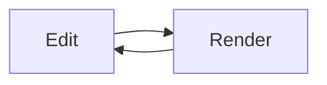

# Welcome to yfmarkdown

A **Typora-style** markdown editor: what you type renders *in place*, and the
block your cursor touches reveals its raw ~~text~~ syntax.

## Features

- [x] Live WYSIWYG editing
- [ ] Try clicking this checkbox
- Inline `code`, [links](https://github.com/automaticdai/yfmd), and images

> Blockquotes render with a styled border.

```python
def hello():
    print("syntax-highlighted code")
```

Math like $e^{i\pi} + 1 = 0$ renders inline, and blocks too:

$$
\int_{-\infty}^{\infty} e^{-x^2}\,dx = \sqrt{\pi}
$$



| Feature | Status |
| ------- | :----: |
| Tables  |   ✔    |
| Export  |   ✔    |

---

Press `Ctrl+/` for source mode.
