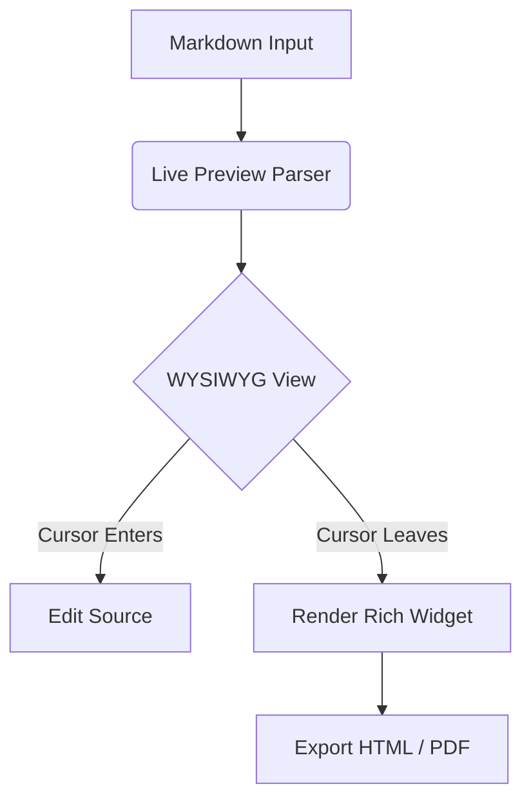

# Welcome to yfmd

A **Typora-style** markdown editor: what you type renders *in place*, and the block your cursor touches reveals its raw markdown syntax.

---

## Inline Styles

- **Bold text**, *italic text*, and ~~strikethrough~~
- Highlighted ==important key terms== with double equals
- Superscript like x^2^ and subscript like H~2~O
- Inline `code` snippets and [hyperlinks](https://github.com/automaticdai/yfmd)

---

## Task Lists & Interactive Checkboxes

- [x] Live WYSIWYG editing
- [x] GitHub alert quote blocks
- [x] Interactive Table Creator ($m \times n$)
- [ ] Interactive task item (click to toggle)

---

## Quote & Alert Callouts

> [!NOTE]
> Highlights information that users should take into account, even when skimming.

> [!TIP]
> Optional information and best practices to help you be more productive.

> [!IMPORTANT]
> Crucial information necessary for successful workflows.

> [!WARNING]
> Critical content demanding attention due to potential risks.

> [!CAUTION]
> Negative potential consequences of an action.

---

## Tables & Table Creator

Use **Edit → Table → Table Creator…** to create custom $m \times n$ tables:

| Feature | Status | Shortcut / Menu |
| :------ | :----: | :-------------- |
| WYSIWYG Editing | Supported | Default Mode |
| Source Code Mode | Supported | `Ctrl + /` |
| Table Creator | Supported | `Edit → Table` |
| Math & KaTeX | Supported | `$$` block / `$` inline |
| Mermaid Diagrams | Supported | ` ```mermaid ` |
| HTML & PDF Export | Supported | `File → Export` |

---

## Code Blocks & Syntax Highlighting

```python
def fibonacci(n: int) -> list[int]:
    """Generate Fibonacci sequence up to n terms."""
    seq = [0, 1]
    while len(seq) < n:
        seq.append(seq[-1] + seq[-2])
    return seq[:n]

print(fibonacci(7))  # [0, 1, 1, 2, 3, 5, 8]
```

---

## Mathematical Formulas (KaTeX)

Euler's identity inline: $e^{i\pi} + 1 = 0$, and Gaussian integral block:

$$
\int_{-\infty}^{\infty} e^{-x^2}\,dx = \sqrt{\pi}
$$

---

## Mermaid Diagrams



---

## Keyboard Shortcuts

| Action | Shortcut |
| :----- | :------- |
| **New Document** | `Ctrl + N` |
| **Open File** | `Ctrl + O` |
| **Save Document** | `Ctrl + S` |
| **Toggle Source Mode** | `Ctrl + /` |
| **Find & Replace** | `Ctrl + F` |
| **Toggle Sidebar** | `Ctrl + Shift + L` |
| **Settings** | `Ctrl + ,` |


